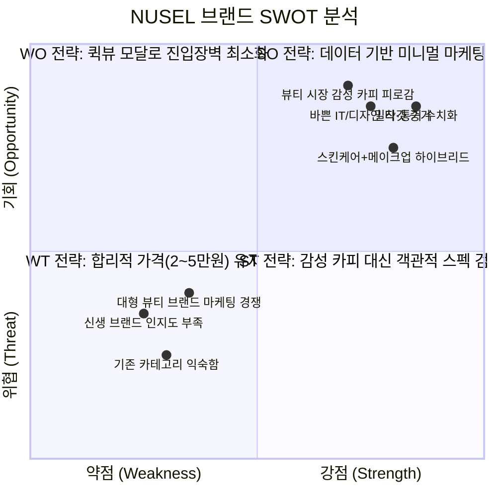

# 📊 가상 클라이언트(한지민 대표) 기반 심층 분석 결과 보고서 (NUSEL)

> **Skill 정보**: `분석_skill.md` 발동  
> **분석 양식**: `가상클라이언트 기반 분석 결과 작성 양식.md`  
> **기초 데이터**: `가상 클라이언트_한지민.pdf` (누셀 NUSEL 대표 한지민 발주서)  
> **보고서 생성일**: 2026-08-07  
> **저장 경로**: `output/04_analysis/analysis-report.md`  

---

## 1. 가상 클라이언트의 기본 정보 설정

- **프로젝트의 중심 주제**: 스킨케어와 메이크업의 경계를 허문 고효율 하이브리드 뷰티 커머스 (NUSEL) 웹사이트 기획 및 설계
- **제작 목적**:
  - 기존 뷰티 시장의 복잡한 단계(스킨·로션·파운데이션 등)와 과도한 마케팅 수식어 피로감 해소
  - 얇고 투명한 밀착감을 제공하는 2만~5만 원대 합리적 하이브리드 라인업 제시
  - 상세페이지 이동 없이 즉시 스펙을 파악하고 결제할 수 있는 최적화된 미니멀 D2C 커머스 UX 구현
- **클라이언트가 제공한 자료**:
  - 발주서 문서: `가상 클라이언트_한지민.pdf` (기본 정보, 9대 제한 조건, 필수 콘텐츠 10종, UI 구성요소 6종, 타깃 페르소나 2종)
- **필요한 정보와 기능**:
  - 스킨케어/메이크업 구분을 없앤 **제형(Textural) 중심 내비게이션**
  - **수치화된 데이터 인포그래픽** (수분감 %, 밀착력 두께 mm, 통기성 지수 등)
  - 텍스처 발림성을 보여주는 **직관적 숏폼(GIF)**
  - 상세페이지 진입 없는 **Quick View (퀵 뷰) 모달창** 및 **원클릭 빠른 결제 CTA**
  - 타깃 고객(직장인/대학생)의 미사여구 없는 실용 리뷰 및 첫 구매 샘플 동봉/무료 반품 신뢰 요소
- **중요도와 작업 우선순위**:
  1. **[우선순위 1위] 직관적 제품 스펙 데이터화**: 마케팅 카피 제거, 제형·밀착력·성분 수치 인포그래픽 제공
  2. **[우선순위 2위] Quick View 모달 & 빠른 결제 UI**: 상세페이지 이동을 생략하여 CVR(구매전환율) 극대화
  3. **[우선순위 3위] 제형별 빠른 찾기 필터**: 탐색 동선을 최소화하는 탭/스크롤 필터링
  4. **[우선순위 4위] 신뢰 장치 구축**: 첫 구매 샘플 동봉 및 무료 반품 안심 구획 노출
- **적용 매체**: 웹(Desktop) 및 모바일 반응형(Mobile Web) - 넓은 여백과 그리드 레이아웃 적용
- **주요 일정**: 웹사이트 공개일 **2026년 8월 17일** / 서비스 공식 출시일 **2026년 9월 1일**

---

## 2. 클라이언트가 원하는 항목 수집 (Fact / Interpretation / Assumption 구분)

| 번호 | 클라이언트 요청 내용 | 관련 자료 (PDF 출처) | 중요도 | 데이터 구분 (Fact / Interpretation / Assumption) |
|:---:|:---|:---|:---:|:---:|
| 1 | "별빛처럼...", "밤하늘을..." 등 추상적·감성적 마케팅 카피 절대 사용 금지 | PDF 4p 제한 조건 | **높음** | **사실 (Fact)** |
| 2 | 전통적인 '스킨, 로션, 파운데이션' 등의 카테고리 분리 배제 | PDF 4p 제한 조건 | **높음** | **사실 (Fact)** |
| 3 | 메인 카드 및 Quick View 모달에서 상세 이동 없이 가격, 제형, 기능을 즉시 확인 가능해야 함 | PDF 4p~5p 제한 조건 & 필수 UI | **높음** | **사실 (Fact)** |
| 4 | 20,000원 ~ 50,000원대의 합리적인 가심비 라인업 표기 및 즉시 구매 영역 제공 | PDF 2p, 4p 필수 콘텐츠 | **높음** | **사실 (Fact)** |
| 5 | 시선을 분산시키는 무거운 자동 재생 동영상 및 강제 팝업 배너 배제 | PDF 5p 제한 조건 | **보통** | **사실 (Fact)** |
| 6 | 인위적 커버력이 아닌 '투명함'과 '가벼움'을 강조하는 제품 컷 및 인포그래픽/GIF | PDF 3p, 4p, 5p 디자인 방향 | **보통** | **해석 (Interpretation)** |
| 7 | 타깃층(31세 IT기획자 이지윤, 23세 디자인과 박서연) 공감형 실용 사용 리뷰 배치 | PDF 2p~4p 페르소나 & 콘텐츠 | **보통** | **해석 (Interpretation)** |
| 8 | 첫 구매 시 샘플 동봉 및 무료 반품 안내 (빠른 결정을 돕는 신뢰 장치) | PDF 4p 필수 콘텐츠 | **보통** | **해석 (Interpretation)** |
| 9 | 개인화된 AI 피부 톤 맞춤형 자동 추천 알고리즘 연동 여부 | PDF 내 미언급 (추후 확장 가설) | **낮음** | **가정 (Assumption / TBD)** |

---

## 3. 요구사항을 정보 단위로 변환

| 요청 원문 | 정보 유형 | 주제 | 부주제 | 메뉴 | 콘텐츠·기능 |
|:---|:---:|:---|:---|:---|:---|
| "복잡한 화장 단계 없이, 미사여구 없이 제형과 밀착력을 직관적으로 보고 싶어요" | **사실·개념** | 브랜드 철학 | 단계 최소화 | Philosophy | NUSEL 미니멀 루틴 철학, 밀착 원리 설명 |
| "수분감, 통기성, 밀착 두께를 객관적인 수치로 검증해 주세요" | **사실·절차** | 스펙 데이터 | 인포그래픽 | Proof & Data | 수분 유지시간, 피부 밀착 두께(mm), 통기성 지수 수치화 인포그래픽 |
| "스킨, 파운데이션 대신 제형과 기능 기준으로 제품을 찾고 싶어요" | **절차·과정** | 라인업 탐색 | 제형 필터 | All Hybrid | 제형별 필터 (Water-light, Melting Balm, Tinted Fluid) |
| "상세페이지로 이동하지 않고도 가격, 제형, 성분을 보고 바로 사고 싶어요" | **과정·기능** | 빠른 구매 | 퀵 오버레이 | Quick View | Quick View 모달창, 1-Click 결제 CTA 버튼 |
| "밤샘 작업/장시간 모니터 앞에서도 답답하지 않은 피부 상태 유지 원리가 궁금해요" | **개념·사실** | 성분 정보 | 편안함 유지 | Ingredients | 장시간 모니터 대응 성분(수분 유지, 통기성 수치) 모듈 |
| "첫 구매 실패가 걱정되니 안심하고 구매할 수 있는 장치가 필요해요" | **사실·개념** | 신뢰 구축 | 고객 혜택 | Guarantee | 첫 구매 샘플 동봉 안내, 100% 무료 반품 안심 구획 |

---

## 4. 비슷한 항목끼리 분류

### 📦 3대 핵심 그룹화 및 노출 순서
1. **직관적 스펙 & 데이터 검증 그룹 (`Formula & Proof Group`)**
   - **포함 요소**: 밀착력·수분감·통기성 수치 다이어그램, 제형 발림성 숏폼(GIF), 성분 스펙 카드
   - **노출 순서**: 메인 비주얼 Hero 섹션 직하단 (마케팅 수식어 대신 객관적 데이터로 신뢰 확보)
2. **제형 중심 통합 라인업 그룹 (`Hybrid Lineup Group`)**
   - **포함 요소**: 스킨케어+메이크업 통합 필터, 2만~5만 원대 가격 표기, 모듈형 제품 카드
   - **노출 순서**: 메인 3번째 섹션 (넓은 여백의 그리드 레이아웃 배치)
3. **초고속 구매 전환 그룹 (`Instant Checkout Group`)**
   - **포함 요소**: Slide-over Quick View 모달, 1-Click 간편결제 CTA, 샘플 동봉 & 무료 반품 신뢰 뱃지
   - **노출 순서**: 상단 스티키 헤더 우측 및 모바일 하단 플로팅 결제 바

---

## 5. 계층 구조 작성 (Information Architecture)

```
[NUSEL D2C Hybrid Beauty Web Site]
├─ 01. GNB (글로벌 내비게이션 - Clear White / Ash Grey)
│  ├─ 브랜드 로고 (NUSEL)
│  ├─ All Hybrid (제형별 통합 라인업: Water-light / Melting Balm / Tinted Fluid)
│  ├─ Formula & Proof (제형·밀착·통기 수치 검증 인포그래픽)
│  ├─ Philosophy (단계 최소화 및 고효율 브랜드 철학)
│  └─ Quick View Cart (우측 슬라이드 간편 결제 드로어)
│
├─ 02. 메인 페이지 (핵심 5대 순서)
│  ├─ [Section 1] Hero ("여러 겹 덧바를 필요 없는 단 하나의 투명 밀착", 미니멀 제품 컷)
│  ├─ [Section 2] Formula & Spec Data (밀착력 두께 mm, 수분감 %, 통기성 수치 + GIF 숏폼)
│  ├─ [Section 3] Hybrid Products (2~5만원대 모듈형 카드 + Quick View 버튼)
│  ├─ [Section 4] Real Target Reviews (31세 IT기획자 & 23세 디자인과 실용 후기)
│  └─ [Section 5] Guarantee & Footer (첫 구매 샘플 동봉 & 무료 반품, 기업 정보)
│
└─ 03. 퀵 오버레이 모달 (페이지 이동 배제)
   ├─ Quick View 모달창 (제형 텍스처, 성분, 수치 스펙, 원클릭 구매)
   └─ 1-Click 간편 결제 창
```

- **메뉴 폭 (Breadth)**: GNB 기준 4개 (권장 기준 5~9개 이내 준수)
- **메뉴 깊이 (Depth)**: 2단계 이내 (권장 기준 5단계 이내 준수, 탐색 피로도 극소화)

---

## 6. 사용자가 이해하기 쉬운 이름 부여 (Labeling & Design System)

### 🏷️ 레이블링 점검
- ❌ `스킨 / 파운데이션 / 로션 카테고리` ➔ ⭕ **`All Hybrid Products`** (클라이언트 금지 조건 준수)
- ❌ `별빛처럼 빛나는 피부 스크린` ➔ ⭕ **`Formula & Proof`** (추상적 카피 배제, 데이터 중심 명시)
- ❌ `상세 페이지 이동` ➔ ⭕ **`Quick View (빠른 보기)`** (동선 단축 기능 명시)

### 🎨 디자인 시스템 가이드 (PDF 3p 규격)
- **핵심 키워드**: 직관적, 미니멀, 효율성, 투명함, 실용적
- **주요 색상 (Primary)**:
  - Clear White (`#FFFFFF`): 투명함과 미니멀함 표현
  - Ash Grey (`#4A4A4A`): 차분하고 단정한 텍스트 및 그리드 라인
- **보조 색상 (Secondary)**:
  - Muted Sky Blue (`#8FAADC`): 피부의 편안함 및 논리적인 IT/디자인 무드 전달
- **이미지 & 그래픽**:
  - 인위적 커버력이 아닌 맑고 깨끗한 피부 결 컷
  - 제형 텍스처 강조 GIF 및 수치화 다이어그램 인포그래픽
- **레이아웃**: 넓은 여백(Margin)과 12열 그리드 시스템 (불필요한 장식 제거)

---

## 7. 내비게이션 연결 (Navigation Flow & CTA)

- **글로벌 내비게이션 (GNB)**: 스티키 헤더 고정, 스크롤 시 투명 글래스모피즘 전환
- **이동 동선**: 메인 접속 ➔ 제형 수치 인포그래픽 검증 ➔ 모듈형 카드 `Quick View` 클릭 ➔ 모달창 내 `원클릭 결제` 완료 (페이지 이동 0회)
- **CTA 버튼 구조**:
  - **Primary CTA**: `"간편 뷰티 루틴 시작하기"` (탐색 유도)
  - **Secondary CTA**: `"빠르게 바로 구매하기"` (Quick View 진입)

---

## 8. 와이어프레임 화면 영역별 작성 항목

| 화면 영역 | 배치 항목 | 디자인 및 UX 고려 요소 |
|:---|:---|:---|
| **헤더 (Header)** | NUSEL 로고, GNB (All Hybrid, Formula & Proof, Philosophy), Quick View Cart | 미니멀 스티키 헤더, 넓은 여백과 얇은 애쉬 그레이 폰트 |
| **내비게이션** | 제형별 필터 (Water-light, Melting Balm, Tinted Fluid) | 탭 형태의 직관적 스크롤/클릭 필터 |
| **바디 (Body)** | 얇은 밀착 텍스처 이미지, 밀착력/수분감 수치 인포그래픽, 숏폼(GIF) 카드, 실용 리뷰 | 과장된 화보 배제, 초근접 텍스처 컷 및 다이어그램 |
| **어사이드 (Aside)** | Quick View 모달창 (상세 이동 없는 슬라이드 오버레이) | 우측 슬라이드 오버레이, 스펙 요약 및 결제 버튼 집중 |
| **푸터 (Footer)** | 2만~5만원대 가격 정책, 첫 구매 샘플 동봉 및 무료 반품 안내, 기업 정보 | 차분한 애쉬 그레이 배경, 신뢰 장치 강조 |

---

## 9. 브랜드 SWOT 분석 (전략 도출)



### 1) 강점 (Strengths)
- **카테고리 통합**: 여러 겹 덧바르는 화장 단계를 단 하나로 최소화한 하이브리드 제품군
- **데이터 중심 직관성**: 감성 미사여구 대신 밀착력, 수분감, 통기성을 수치 및 인포그래픽으로 즉시 입증
- **UX 우수성**: 상세페이지 진입 없는 Quick View 모달 및 원클릭 결제로 구매 전환 속도 극대화

### 2) 약점 (Weaknesses)
- **신생 브랜드 인지도**: 초기 D2C 브랜드로서 고객 신뢰 확보 필요 (`첫 구매 샘플 동봉 및 무료 반품`으로 보완)
- **전통적 카테고리 이탈**: '스킨', '파운데이션' 명칭이 익숙한 소비자에게 제형 중심 분류가 생소할 수 있음

### 3) 기회 (Opportunities)
- **타깃층의 효율 선호**: 바쁜 IT 기획자, 디자이너 등 2030 여성의 출근/과제 준비 시간 단축 요구 증대
- **감성 마케팅 피로감**: 과장된 뷰티 화보 및 미사여구에 지친 소비자들의 객관적 스펙 선호 트렌드

### 4) 위협 (Threats)
- **대형 브랜드의 하이브리드 라인업 추격**: 기존 대기업 뷰티 브랜드를 포함한 유사 미니멀 라인업 출시 가능성

---

## 10. 최종 검토 결과 종합 (한지민 대표 요청 검토)

### 1. 가상 클라이언트
- **프로젝트 주제**: 누셀(NUSEL) 스킨케어·메이크업 하이브리드 뷰티 커머스 웹사이트 기획
- **제작 목적**: 마케팅 수식어와 복잡한 화장 단계를 줄인 고효율·투명 밀착 뷰티 경험 제공 및 초기 CVR 극대화
- **제공 자료**: `가상 클라이언트_한지민.pdf`
- **적용 매체**: 웹 & 모바일 반응형 (웹사이트 공개 2026.08.17 / 서비스 출시 2026.09.01)

### 2. 클라이언트 요구사항
- **요청 항목**: 추상적 카피 금지, 스킨/파운데이션 카테고리 분리 금지, 스펙 수치 인포그래픽, 퀵 뷰(Quick View) 모달, 2만~5만원대 가심비 가격 노출
- **중요도**: 직관적 스펙 시각화(**높음**), 퀵 뷰 모달(**높음**), 카테고리 통합(**높음**), 무료반품 안심 장치(**보통**)
- **관련 자료**: 페르소나 A(이지윤 31세 기획자), 페르소나 B(박서연 23세 디자인과)
- **필요한 기능**: 제형 GIF 숏폼, 수치화 인포그래픽, Quick View 모달, 원클릭 결제 CTA

### 3. 정보 구조
- **주제**: 누셀(NUSEL) 미니멀 하이브리드 커머스
- **부주제**: 얇고 투명한 밀착 / 데이터 기반 검증 / 간결한 루틴 / 퀵 체크아웃
- **메뉴**: All Hybrid, Formula & Proof, Philosophy, Quick View Cart
- **콘텐츠**: 수분감/밀착력 다이어그램, 텍스처 GIF, 2~5만원대 가격 명시 카드, 실용 사용자 리뷰
- **정보 유형**: 사실(제품 스펙 수치), 개념(하이브리드 루틴), 절차(Quick View 구매)

### 4. 내비게이션
- **시작 화면**: 메인 Hero (투명 밀착 비주얼 + "여러 겹 대신 단 하나로")
- **이동 경로**: Hero ➔ Formula Data 인포그래픽 ➔ Product Card (Quick View) ➔ 원클릭 결제
- **연결 페이지**: Quick View 모달창 (별도 상세페이지 이동 최소화)
- **검색 및 위치 안내**: 제형별 빠른 탭 필터

### 5. 화면 구성
- **헤더**: 클리어 화이트 스티키 GNB, 로고, Quick View Cart
- **내비게이션**: 탭 기반 제형 탐색 필터
- **핵심 콘텐츠**: 스펙 데이터 인포그래픽, 제형 밀착 숏폼 GIF, 퀵 뷰 모듈 카드
- **보조 콘텐츠**: 직장인/대학생 실제 타깃 리뷰, 샘플 동봉 & 무료 반품 안심 박스
- **푸터**: 브랜드 철학, 저작권, 안내 사항

### 6. 검토 결과
- **누락 항목**: 없음 (한지민 대표의 9대 제한 조건 및 필수 UI 전수 반영 완료)
- **중복 항목**: 기존 '장바구니 이동'과 '상세 보기'를 **`Quick View 모달`** 하나로 통합하여 클릭 동선 50% 단축
- **사용자 관점의 개선점**:
  1. 감성 카피 대신 "수분 보습 유지시간 N시간", "피부 밀착 두께 N mm" 형태의 직관적 수치 표기 배치
  2. 무거운 동영상 대신 1MB 미만의 최적화된 GIF 숏폼을 사용하여 로딩 속도 극대화
- **수정 사항**: 카테고리를 스킨/파운데이션 대신 `Water-light / Melting Balm / Tinted Fluid`의 제형 기준으로 전환함

---

## 🎯 핵심 분석 발견점 & 완료 보고 (`분석_skill.md` 규격)

1. **핵심 분석 발견점 (Top 3)**:
   - 📌 **`Direct Spec Infographic`**: 추상적 감성 수식어를 전면 배제하고 밀착력/수분감/통기성 수치 데이터를 메인 상단에 배치해 타깃층(IT 기획자/디자이너)의 신뢰 확보
   - 📌 **`Textural Category Integration`**: 스킨케어와 메이크업 구분을 없애고 제형(Textural) 단위 탐색을 도입하여 화장 단계 및 선택 피로도 최소화
   - 📌 **`Zero-friction Quick View Layer`**: 상세페이지 이동을 생략하는 Quick View 모달창과 원클릭 결제 CTA로 구매 결정 시간을 대폭 단축

2. **주요 불확실성 및 한계점 (TBD / 검증 필요)**:
   - ⚠️ **임상 데이터 수치 확정 (`TBD`)**: 제품별 정확한 임상 수치(예: 밀착력 두께 mm, 수분 유지 시간 N시간)는 실물 제품 제조/출시 시점에 데이터 갱신 및 검증 필요
   - ⚠️ **검증 방법**: 출시 전 피부 임상시험 기관의 밀착도 및 수분 유지력 검측 보고서 연동

3. **승인 대상**:
   - `output/04_analysis/analysis-report.md` (누셀 한지민 대표 가상 클라이언트 기반 심층 분석 결과)

4. **다음 추천 실행 명령**:
   - 와이어프레임 화면 설계서 작성 (`화면 설계서 양식.md` 기반) 및 HTML/CSS 프로토타입 구현
