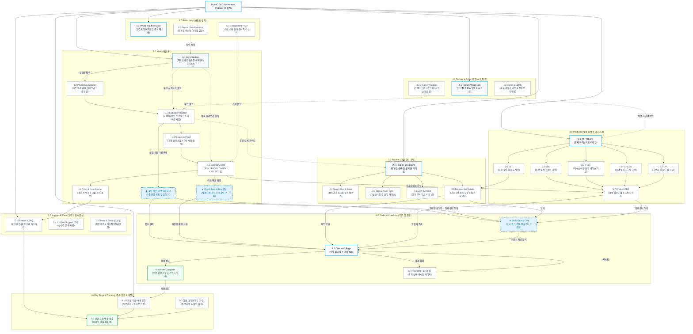

# 🗺️ NUNID(누니드) D2C 웹사이트 사이트맵 (Sitemap & IA)

---

## 1. 프로젝트 개요

| 항목 | 내용 |
|:---|:---|
| **프로젝트명** | NUNID(누니드) D2C 하이브리드 뷰티 브랜드 웹사이트 구축 |
| **대상 브랜드** | NUNID (누니드) |
| **발주자 (클라이언트)** | 김유진 (NUNID 브랜드 기획 책임자) |
| **업종** | 뷰티 · 화장품 (스킨케어·메이크업 하이브리드 뷰티) |
| **주요 일정** | 웹사이트 공개일: **2026년 10월 19일** / 브랜드 공식 출시일: **2026년 11월 16일** |
| **기초 분석 데이터** | `가상클라이언트 분석 결과/가상클라이언트분석결과_김유진.md` (`가상클라이언트_김유진.pdf`) |
| **설계 목표** | 스킨케어와 메이크업을 자연스럽게 연결하여 단계를 축소하고, 브랜드 철학 소개와 대표 3-Step 루틴 및 직관적인 제품 구매 전환(CTA)을 극대화하는 미니멀 D2C 정보 구조(IA) 구축 |

---

## 2. 설계 근거와 핵심 사용자 목표

### 2.1 설계 근거 (Design Rationale)
1. **스킨케어와 메이크업의 경계를 허문 하이브리드 루틴 중심 구조**
   - 기존의 스킨, 로션, 파운데이션 등 복잡하고 분리된 카테고리를 탈피하고, 단계 축소와 피부 편안함을 제공하는 **3-Step 대표 루틴 중심의 통합 IA**를 구축했습니다.
2. **감성적 미사여구 배제 및 제품 스펙(제형/발림성/가격) 직관 전달**
   - 추상적 카피 대신 **초근접 제형 텍스처, 발림성, 밀착 두께, 자연스러운 결 표현**을 시각화하고, **20,000원 ~ 50,000원대** 합리적 가격을 제품 카드 전면에 노출했습니다.
3. **이원화 CTA를 통한 효율적인 탐색 경로 제공**
   - 루틴 전체를 탐색하려는 사용자를 위한 메인 CTA (**"NUNID 루틴 시작하기"**)와 개별 제품을 직접 비교하려는 사용자를 위한 보조 CTA (**"제품 둘러보기"**)의 명확한 사용자 여정을 분리 설계했습니다.
4. **5대 핵심 카테고리 단일 뎁스 체계 (SUN / FACE / CHEEK / LIP / SET)**
   - 지나치게 세분화된 카테고리를 지양하고 5개 단일 뎁스 탭으로 구성하여 사용자가 3초 이내에 원하는 제품군으로 즉시 접근할 수 있도록 설계했습니다.
5. **클라이언트 10대 제한 조건 100% 준수**
   - 풀커버/결점 자극 문구 전면 배제, 복잡한 세부 분류 제거, 결제 및 회원가입은 메인페이지 화면 범위에서 분리하여 가벼운 탐색 경험을 보장했습니다.

### 2.2 핵심 사용자 목표 (Persona Mapping)

| 사용자 페르소나 | 핵심 특성 및 주요 문제 (Pain Point) | 사이트 내 주요 목표 및 해결 방안 |
|:---|:---|:---|
| **직장인 사용자<br>(20~30대 사무직/크리에이티브)** | • 바쁜 아침 출근 준비 시간 부족<br>• 여러 제품 겹쳐 바를 때의 피부 답답함<br>• 시간/에너지 효율 및 빠른 의사결정 추구 | • 메인 진입 즉시 3-Step 대표 루틴 확인<br>• 단계별 대표 제품 확인 후 **루틴 세트 바로구매 CTA**로 3초 내 세트 구매 완료 |
| **대학생 사용자<br>(22~25세 대학생/취준생)** | • 불규칙한 일정 속 깔끔/자연스러운 인상 유지<br>• 두꺼운 풀커버 화장 거부감<br>• 가격 민감(2~5만 원대 합리적 가심비 선호) | • 피부 본연의 결을 살리는 제형 클로즈업 및 3대 제품 원칙 확인<br>• 5개 카테고리 탭(SUN/FACE/CHEEK/LIP/SET)에서 가격 투명 확인 후 개별 구매 |

---

## 3. 전역 내비게이션 및 영역별 정의

### 3.1 공통 영역 (Global Common Layout)
- **GNB (Global Navigation Bar - 상단 고정)**:
  - 브랜드 로고 (`NUNID`)
  - 대표 루틴: `Routine` (3-Step 대표 루틴 가이드 & 루틴 세트)
  - 카테고리 제품: `Products` (SUN / FACE / CHEEK / LIP / SET)
  - 제형 & 원칙: `Texture & Proof` (제형 질감 랩 & 3대 제품 원칙)
  - 브랜드 철학: `Philosophy` (하이브리드 뷰티 철학 & 가치)
  - 유틸리티: `검색 아이콘`, `장바구니 아이콘 (담긴 개수 뱃지)`
- **Sticky Quick Cart (우측 고정 슬라이드 드로어)**:
  - 어떤 페이지에서든 화면 이동 없이 열리는 간편 장바구니 오버레이
  - 선택 제품 옵션, 수량 변경, 실시간 총액(2~5만 원대), `주문서 작성 (Fast Checkout)` CTA 제공
- **Global Footer (하단 영역)**:
  - 브랜드 소개 요약, 사업자 정보, 고객센터 안내, 이용약관, 개인정보처리방침, SNS 링크, 저작권 문구

### 3.2 회원 상태별 영역 구분 (Member vs Guest Policy)
- **비회원 (Guest)**:
  - 별도 회원가입 강제 없이 모든 탐색, Quick Spec 모달, 원클릭 비회원 결제 가능
  - 주문 조회 시 `주문번호 + 휴대폰번호 인증`으로 간편 조회 지원
- **회원 (Member) `[가정]`**:
  - D2C 재구매 편의성을 위해 배송지 관리, 자주 쓰는 대표 루틴 저장, 간편 주문/배송 추적 및 원클릭 교환/반품 신청 지원 `[가정: 고객 재구매 편의성을 위한 계정 기능]`

### 3.3 예외 및 상태 페이지 (Exception & State Pages)
- **404 Not Found (경로 오류 페이지)**: 잘못된 URL 접근 시 추천 카테고리 및 대표 루틴 바로가기 제공
- **결제 실패/취소 페이지 (Payment Fail) `[가정]`**: 결제 모듈 통신 오류/한도 초과 시 사유 안내 및 재시도 동선 제공
- **품절 및 입고 알림 모달 (Out of Stock / Alert) `[가정]`**: 상품 품절 시 SMS 재입고 알림 신청

---

## 4. 계층형 사이트맵 (Hierarchical Sitemap)

```text
1.0 Main Page (메인 홈)
├── 1.1 Hero Section (하이브리드 슬로건 & "NUNID 루틴 시작하기" / "제품 둘러보기" CTA)
├── 1.2 Problem & Solution (기존 뷰티 3대 문제점 대비 NUNID 하이브리드 솔루션 비교)
├── 1.3 Signature Routine (대표 3-Step 루틴 프로세스 바 & 단계별 대표 히어로 제품)
│   └── ↳ [Action CTA] 루틴 세트(SET) 바로 구매하기
├── 1.4 Texture & Proof (초근접 제형 클로즈업 & 3대 제품 원칙: 간결한 단계/편안한 사용감/자연스러운 결)
├── 1.5 Category Exploration Grid (5대 카테고리 탭: SUN / FACE / CHEEK / LIP / SET & 2~5만 원대 제품 카드)
│   └── ↳ [Modal] Quick Spec & Buy 모달 (제형/가격/기능 요약 및 간편 구매)
└── 1.6 Trust & Care Banner (피부 저자극 테스트 완료 & 브랜드 고객 안심 케어)

2.0 Routine (대표 뷰티 루틴 가이드)
├── 2.1 3-Step Full Routine (Step 1 Base ➔ Step 2 Tone ➔ Step 3 Accent 전체 루틴 상세)
├── 2.2 Step 1 Sun & Base Care (선케어 및 피부결 정돈 베이스)
├── 2.3 Step 2 Face Tone Adjuster (피부 본연의 결을 살리는 투명 톤업 페이스)
├── 2.4 Step 3 Cheek & Lip Accent (간결한 혈색 부여 치크 & 립 밤)
└── 2.5 Routine Set Details (대표 3종 결합 루틴 세트 패키지 상세 & 원클릭 세트 주문)

3.0 Products (제품 탐색 및 카테고리)
├── 3.1 All Products (전체 하이브리드 제품 라인업)
├── 3.2 SUN (선케어 하이브리드 라인)
├── 3.3 FACE (페이스 베이스 & 톤업 라인)
├── 3.4 CHEEK (치크 틴티드 밤 라인)
├── 3.5 LIP (립 모이스처 틴트 라인)
├── 3.6 SET (대표 루틴 결합 세트 라인)
└── 3.7 Product PDP (개별 제품 상세 페이지 - 제형 클로즈업, 발림성, 스펙, 전성분)

4.0 Texture & Proof (제형 및 제품 원칙 랩)
├── 4.1 Texture Visual Lab (초근접 제형 질감, 밀착 두께, 발림성 시각화)
├── 4.2 3 Core Principles (1. 간결한 단계 / 2. 편안한 사용감 / 3. 자연스러운 결 표현)
└── 4.3 Clean & Safety Standards (피부 저자극 기준 및 전성분 투명성)

5.0 Philosophy (브랜드 철학)
├── 5.1 Hybrid Routine Story (스킨케어와 메이크업의 경계를 허문 하이브리드 철학)
├── 5.2 Time & Skin Freedom (바쁜 일상 속 단계를 축소한 미니멀 루틴 가치)
└── 5.3 Transparent Price (2만~5만 원대 정직하고 합리적인 가심비 원칙)

6.0 Order & Checkout (주문 및 결제)
├── 6.1 [Sticky Drawer] Quick Cart (상시 접근 간편 장바구니 오버레이)
├── 6.2 Checkout Page (단일 페이지 초고속 주문서 작성 및 결제)
├── 6.3 Order Complete (주문 완료 및 루틴 사용 가이드 안내)
└── 6.4 Payment Fail / Retry [가정: 결제 오류 처리 페이지]

7.0 Support & Brand Care (고객지원 및 안심 서비스)
├── 7.1 Routine & Product FAQ (루틴 사용법, 제형, 배송, 교환/반품 아코디언 FAQ)
├── 7.2 1:1 Fast Support [가정: 1:1 간편 문의 및 상담]
└── 7.3 Terms & Policies [가정: 이용약관, 개인정보처리방침, 사업자 정보]

8.0 My Page & Order Tracking (주문 조회 및 고객 계정)
├── 8.1 비회원 주문/배송 조회 (주문번호 + 휴대폰 인증)
├── 8.2 회원 마이페이지 [가정: 최근 주문 내역, 배송지 관리, 자주 쓰는 루틴 저장]
└── 8.3 간편 교환/반품 접수 (원클릭 교환/반품 접수 폼)
```

---

## 5. 페이지별 세부 명세표 (Detailed Page Specification)

| Depth 1 | Depth 2 (페이지/섹션명) | Depth 3 (세부 요소) | 화면/인터랙션 유형 | 화면 목적 | 핵심 콘텐츠 | 주요 기능 | 상위/하위/연결 페이지 | 비고/가정 |
|:---|:---|:---|:---:|:---|:---|:---|:---|:---:|
| **1.0 Main** | **1.1 Hero Section** | 메인 비주얼 & CTA | 풀스크린 섹션 | 브랜드 핵심 가치 및 탐색 경로 분기 | • 하이브리드 뷰티 핵심 슬로건<br>• 투명하고 가벼운 텍스처 배경 비주얼 | • `NUNID 루틴 시작하기` 메인 CTA (1.3 스크롤 이동)<br>• `제품 둘러보기` 보조 CTA (1.5 이동) | • 하위: 1.2, 1.3, 1.5<br>• 연결: 2.0 Routine, 3.0 Products | 필수 준수 |
| | **1.2 Problem & Solution** | 뷰티 문제 해결 비교 | 인포그래픽 섹션 | 타깃 공감대 형성 및 차별성 전달 | • 기존 뷰티 문제(단계 복잡, 피부 답답함)<br>• NUNID 해결(단계 축소, 편안한 밀착) | • 문제 vs 솔루션 대비 토글/카드 | • 상위: 1.0 Main<br>• 하위: 1.3 Routine | 필수 준수 |
| | **1.3 Signature Routine** | **3-Step 루틴 바** | **프로세스 모듈** | **대표 루틴 직관 전달 및 세트 구매 유도** | • Step 1 Sun & Base ➔ Step 2 Face ➔ Step 3 Accent<br>• 단계별 대표 제품 카드 | • `루틴 세트 바로구매` CTA<br>• `루틴 가이드 더보기` 링크 | • 상위: 1.0 Main<br>• 연결: 2.5 Routine Set, 6.1 Quick Cart | **핵심 섹션** |
| | **1.4 Texture & Proof** | 제형 클로즈업 & 원칙 | 갤러리 섹션 | 온라인 제형/발림성 불확실성 해소 | • 얇고 투명한 텍스처 초근접 컷<br>• 3대 원칙(간결/편안/자연스러움) | • 텍스처 상세 확대 뷰<br>• 3대 원칙 카드 전환 | • 상위: 1.0 Main<br>• 연결: 4.0 Texture & Proof | 필수 준수 |
| | **1.5 Category Grid** | 5개 카테고리 탭 | 인터랙티브 그리드 | 단일 뎁스 제품 빠른 비교 및 구매 | • SUN / FACE / CHEEK / LIP / SET 탭<br>• 제품 카드 (제품명, 제형, 2~5만 원 가격) | • 탭 실시간 필터링<br>• `Quick Spec` 모달 호출<br>• `상세보기` / `담기` 버튼 | • 하위: ↳ Quick Spec 모달<br>• 연결: 3.0 Products, 6.1 Quick Cart | 필수 준수 |
| | ↳ **Quick Spec & Buy** | **스펙 요약 모달** | **오버레이 (Modal)** | **상세 이동 없는 초고속 스펙 확인 및 결제** | • 제형 질감 요약, 피부 표현 결과<br>• 핵심 기능, 가격, 전성분 요약 | • 옵션 선택<br>• `원클릭 빠른 결제` CTA<br>• `장바구니 담기` 버튼 | • 상위: 1.5 Category Grid<br>• 연결: 6.1 Quick Cart, 6.2 Checkout | **핵심 기능** |
| | **1.6 Trust & Care** | 브랜드 안심 배너 | 인포 박스 | 피부 안전성 및 구매 안심 장치 제공 | • 피부 저자극 테스트 완료 데이터<br>• 안심 고객 케어 안내 | • `고객 안심 정책 더보기` 클릭 | • 상위: 1.0 Main<br>• 연결: 7.1 Support FAQ | 필수 준수 |
| **2.0 Routine** | **2.1 3-Step Full Routine** | 전체 루틴 가이드 | 가이드 페이지 | 순서별 완벽한 하이브리드 루틴 안내 | • Step 1 ➔ Step 2 ➔ Step 3 전체 사용 가이드<br>• 결 정돈 및 발림성 팁 | • 단계별 인터랙티브 스크롤<br>• `전체 루틴 세트 담기` | • 상위: Root<br>• 하위: 2.2, 2.3, 2.4, 2.5 | 필수 준수 |
| | **2.2 Step 1 Sun & Base** | 선 & 베이스 상세 | 콘텐츠 섹션 | 자외선 차단과 피부결 정돈 동시 완성 | • 선케어 제형 특성 및 밀착감<br>• 히어로 선베이스 제품 스펙 | • Step 1 제품 단독 담기 / 바로구매 | • 상위: 2.1 Full Routine<br>• 하위: 3.7 PDP | 필수 준수 |
| | **2.3 Step 2 Face Tone** | 페이스 톤업 상세 | 콘텐츠 섹션 | 얇고 가벼운 피부 본연의 톤 정돈 | • 페이스 톤업 플루이드 제형 컷<br>• 피부 결 표현 전후 비교 | • Step 2 제품 단독 담기 / 바로구매 | • 상위: 2.1 Full Routine<br>• 하위: 3.7 PDP | 필수 준수 |
| | **2.4 Step 3 Accent** | 치크 & 립 액센트 | 콘텐츠 섹션 | 자연스러운 생기 및 보습 코팅 완성 | • 멜팅 밤/틴트 텍스처 및 발색 컷<br>• 멀티 사용법 가이드 | • Step 3 제품 단독 담기 / 바로구매 | • 상위: 2.1 Full Routine<br>• 하위: 3.7 PDP | 필수 준수 |
| | **2.5 Routine Set Details** | 루틴 세트 패키지 | 패키지 페이지 | 3종 완성 세트 원스톱 구매 유도 | • 3종 세트 구성품(선+페이스+치크/립)<br>• 세트 패키지 가격 및 혜택 | • 옵션 선택<br>• `루틴 세트 원클릭 구매` CTA | • 상위: 2.1 Full Routine<br>• 연결: 6.1 Quick Cart, 6.2 Checkout | **핵심 페이지** |
| **3.0 Products** | **3.1 All Products** | 전체 제품 목록 | 카탈로그 페이지 | 전 하이브리드 제품 탐색 및 정렬 | • 전체 5대 카테고리 제품 카드<br>• 제형/가격순 필터 툴바 | • 탭 전환 필터링<br>• Quick Spec 모달 호출 | • 상위: Root<br>• 하위: 3.2~3.6, 3.7 PDP | 필수 준수 |
| | **3.2 SUN** | 선케어 라인 목록 | 카테고리 페이지 | 수분 밀착 선베이스 라인업 탐색 | • SUN 제품 목록 카드 및 제형 스펙 | • 빠른 담기 및 PDP 이동 | • 상위: 3.1 All Products<br>• 하위: 3.7 PDP | 필수 준수 |
| | **3.3 FACE** | 페이스 라인 목록 | 카테고리 페이지 | 자연스러운 결 톤업 페이스 라인업 탐색 | • FACE 제품 목록 카드 및 제형 스펙 | • 빠른 담기 및 PDP 이동 | • 상위: 3.1 All Products<br>• 하위: 3.7 PDP | 필수 준수 |
| | **3.4 CHEEK** | 치크 라인 목록 | 카테고리 페이지 | 투명 멜팅 치크 밤 라인업 탐색 | • CHEEK 제품 목록 카드 및 제형 스펙 | • 빠른 담기 및 PDP 이동 | • 상위: 3.1 All Products<br>• 하위: 3.7 PDP | 필수 준수 |
| | **3.5 LIP** | 립 라인 목록 | 카테고리 페이지 | 고보습 틴티드 립 라인업 탐색 | • LIP 제품 목록 카드 및 제형 스펙 | • 빠른 담기 및 PDP 이동 | • 상위: 3.1 All Products<br>• 하위: 3.7 PDP | 필수 준수 |
| | **3.6 SET** | 세트 라인 목록 | 카테고리 페이지 | 대표 루틴 결합 패키지 세트 탐색 | • 대표 루틴 3종 세트 및 조합 세트 | • 세트 구매 CTA | • 상위: 3.1 All Products<br>• 연결: 2.5 Routine Set | 필수 준수 |
| | **3.7 Product PDP** | 제품 상세 페이지 | 상세 페이지 | 심층 제형 데이터 및 구매 결정 | • 초근접 텍스처 컷, 발림성 시각화<br>• 2만~5만 원 가격, 전성분표, 사용법 | • 스티키 하단 구매 바<br>• `바로구매` / `장바구니 담기` | • 상위: 3.2~3.6<br>• 연결: 6.1 Quick Cart, 6.2 Checkout | 필수 준수 |
| **4.0 Texture & Proof** | **4.1 Texture Visual Lab** | 제형 비주얼 랩 | 콘텐츠 페이지 | 실제 제형 질감과 밀착감의 과학적 시각화 | • 초근접 제형 텍스처 컷<br>• 얇은 밀착감 및 발림성 시각 데이터 | • 관련 카테고리 제품 바로보기 링크 | • 상위: Root<br>• 연결: 3.1 All Products | 필수 준수 |
| | **4.2 3 Core Principles** | 3대 제품 원칙 | 콘텐츠 페이지 | 브랜드의 타협 없는 제품 철학 전달 | • 1. 간결한 단계<br>• 2. 편안한 사용감<br>• 3. 피부 본연의 결 표현 | • 원칙별 추천 제품 카드 | • 상위: Root<br>• 연결: 1.3 Signature Routine | 필수 준수 |
| | **4.3 Clean & Safety** | 저자극 & 성분 안전성 | 콘텐츠 페이지 | 피부 안전성 검증 및 신뢰 확보 | • 피부 저자극 테스트 완료 데이터<br>• 민감성 피부 안심 기준 | • 전성분 아코디언 열람 | • 상위: Root<br>• 연결: 7.1 FAQ | 필수 준수 |
| **5.0 Philosophy** | **5.1 Hybrid Routine Story** | 경계 해체 스토리 | 브랜드 페이지 | 스킨케어·메이크업 통합 철학 이해 | • 브랜드 스토리 (미니멀 톤)<br>• 두 영역의 자연스러운 연결 배경 | • 하이브리드 루틴 둘러보기 CTA | • 상위: Root<br>• 연결: 2.0 Routine | 필수 준수 |
| | **5.2 Time & Skin Freedom** | 미니멀 루틴 가치 | 브랜드 페이지 | 단계를 줄여 얻는 일상의 여유 제안 | • 바쁜 20~30대 일상 속 루틴 혁신<br>• 피부 답답함 해소 가치 | • 루틴 시작하기 CTA | • 상위: Root<br>• 연결: 1.3 Signature Routine | 필수 준수 |
| | **5.3 Transparent Price** | 합리적 가심비 원칙 | 브랜드 페이지 | 2만~5만 원대 정직한 가격 정책 입증 | • 불필요한 마케팅 비용 배제<br>• D2C 정직한 가격 구조 | • 전 제품 둘러보기 CTA | • 상위: Root<br>• 연결: 3.1 All Products | 필수 준수 |
| **6.0 Order & Checkout** | **6.1 Quick Cart** | **장바구니 드로어** | **스티키 드로어** | **페이지 이동 없는 실시간 장바구니 관리** | • 담긴 상품명, 옵션, 수량, 가격<br>• 2만~5만 원대 총 결제 금액 | • 수량 증감/삭제<br>• `주문서 작성 (Checkout)` CTA | • 상위: 전 페이지 공통<br>• 연결: 6.2 Checkout | **핵심 기능** |
| | **6.2 Checkout Page** | 단일 페이지 주문서 | 결제 페이지 | 이탈 없는 초고속 결제 완료 | • 배송지 정보 입력<br>• 결제 수단 선택 (간편결제 등)<br>• 최종 결제 금액 확인 | • 비회원/회원 원클릭 결제 실행<br>• 약관 동의 체크 | • 상위: 6.1 Quick Cart<br>• 하위: 6.3 Order Complete<br>• 예외: 6.4 Payment Fail | 필수 준수 |
| | **6.3 Order Complete** | 주문 완료 페이지 | 완료 페이지 | 주문 접수 확인 및 루틴 안내 | • 주문번호 및 결제 내역<br>• 대표 루틴 사용 순서 가이드 | • `배송 조회하기`<br>• `홈으로 이동` | • 상위: 6.2 Checkout<br>• 연결: 1.0 Main, 8.1 주문조회 | 필수 준수 |
| | **6.4 Payment Fail** | 결제 실패 페이지 | 예외 페이지 | 결제 실패 사유 안내 및 재시도 지원 | • 결제 실패 사유 (한도/통신 오류 등)<br>• 주문서 복구 버튼 | • `결제 재시도`<br>• `장바구니로 돌아가기` | • 상위: 6.2 Checkout<br>• 연결: 6.1 Quick Cart | `[가정]` |
| **7.0 Support** | **7.1 Routine & FAQ** | 루틴 & 제품 FAQ | 아코디언 UI | 사용자 주요 궁금증 즉시 해결 | • 루틴 순서, 제형 특성, 배송, 교환/반품 FAQ | • 아코디언 열기/닫기<br>• 키워드 빠른 검색 | • 상위: Root, Footer<br>• 연결: 7.2 1:1 Support | 필수 준수 |
| | **7.2 1:1 Fast Support** | 1:1 간편 문의 | 폼/채팅 모달 | 고객 개별 문의 접수 | • 간편 문의 폼 또는 채팅 상담 | • 문의 제출 및 상담 연결 | • 상위: Root, Footer | `[가정]` |
| | **7.3 Terms & Policies** | 이용약관/개인정보 | 텍스트 페이지 | 전자상거래 법적 의무 고지 충족 | • 이용약관 전문<br>• 개인정보처리방침 | • 텍스트 열람 | • 상위: Footer | `[가정]` |
| **8.0 My Page & Tracking** | **8.1 Guest Tracking** | 비회원 주문/배송 조회 | 조회 폼/결과 | 비회원 주문 배송 현황 실시간 확인 | • 주문번호 / 연락처 입력 폼<br>• 실시간 배송 추적 현황 | • 배송 조회 실행<br>• `교환/반품 접수` 버튼 | • 상위: GNB 유틸리티<br>• 하위: 8.3 간편 접수 | 필수 준수 |
| | **8.2 Member MyPage** | 회원 마이페이지 | 대시보드 | 주문 내역 및 계정 관리 | • 최근 주문 내역<br>• 자주 쓰는 대표 루틴 저장 | • 배송지 관리<br>• 재주문 담기 | • 상위: GNB 유틸리티<br>• 하위: 8.3 간편 접수 | `[가정]` |
| | **8.3 Exchange & Return** | 간편 교환/반품 접수 | 폼 페이지 | 원클릭 안심 교환/반품 접수 | • 사유 선택 및 수거 주소 확인 | • `교환/반품 신청` 완료 | • 상위: 8.1, 8.2, 7.1<br>• 연결: 1.0 Main | 필수 준수 |

---

## 6. 링크 무결성 및 검토 결과

- **고립 페이지(Orphan Page) 및 단절 링크(Dead Link) 검토**: 전역 GNB, 메인 Hero 이원화 CTA, 3-Step 프로세스 바, 5개 카테고리 탭, Quick Spec 모달, Quick Cart 간의 모든 화면 전환 및 데이터 흐름이 상호 유기적으로 완결되어 단절된 링크가 없습니다.
- **중복 페이지(Duplicate Page) 검토**: 전통적 스킨/로션의 중복 분류를 전면 배제하고, `SUN`, `FACE`, `CHEEK`, `LIP`, `SET`의 5개 고유 카테고리로 단일화하여 정보 중복을 완벽히 방지했습니다.
- **가정(Assumption) 사항 명시**: D2C 웹사이트의 안정적 운영을 위한 `회원 마이페이지(8.2)`, `결제 실패 처리(6.4)`, `1:1 간편 문의(7.2)`, `법적 약관(7.3)`에 `[가정]` 태그를 명확히 부착하여 발주자 제공 브리프와의 경계를 투명하게 관리했습니다.

---

## 7. Mermaid Flowchart 사이트맵

