# 🔄 NUNID(누니드) D2C 웹사이트 서비스 흐름도 (Service User Flow)

> **기반 분석 자료**: [`가상클라이언트 분석 결과/가상클라이언트분석결과_김유진.md`](file:///C:/Users/SBS/pjy/%EA%B0%80%EC%83%81%ED%81%B4%EB%9D%BC%EC%9D%B4%EC%96%B8%ED%8A%B8%20%EB%B6%84%EC%84%9D%20%EA%B2%B0%EA%B3%BC/%EA%B0%80%EC%83%81%ED%81%B4%EB%9D%BC%EC%9D%B4%EC%96%B8%ED%8A%B8%EB%B6%84%EC%84%9D%EA%B2%B0%EA%B3%BC_%EA%B9%80%EC%9C%A0%EC%A7%84.md) / [`가상클라이언트_김유진.pdf`](file:///C:/Users/SBS/pjy/%EA%B0%80%EC%83%81%ED%81%B4%EB%9D%BC%EC%9D%B4%EC%96%B8%ED%8A%B8/%EA%B0%80%EC%83%81%ED%81%B4%EB%9D%BC%EC%9D%B4%EC%96%B8%ED%8A%B8_%EA%B9%80%EC%9C%A0%EC%A7%84.pdf)  
> **사이트맵 참조**: [`가상클라이언트 설계 결과/설계 출력물 (김유진)/사이트 구조맵/사이트맵.md`](file:///C:/Users/SBS/pjy/%EA%B0%80%EC%83%81%ED%81%B4%EB%9D%BC%EC%9D%B4%EC%96%B8%ED%8A%B8%20%EC%84%A4%EA%B3%84%20%EA%B2%B0%EA%B3%BC/%EC%84%A4%EA%B3%84%20%EC%B6%9C%EB%A0%A5%EB%AC%BC%20%28%EA%B9%80%EC%9C%A0%EC%A7%84%29/%EC%82%AC%EC%9D%B4%ED%8A%B8%20%EA%B5%AC%EC%A1%B0%EB%A7%B5/%EC%82%AC%EC%9D%B4%ED%8A%B8%EB%A7%B5.md)  
> **핵심 설계 원칙**: `탐색 ➔ 선택 ➔ 상세 확인 ➔ 핵심 행동 ➔ 결과 확인`의 최단거리 동선, 이원화 CTA 지원, 3-Step 완성형 루틴 세트 원클릭 구매, 5개 카테고리 기반 Quick Spec 모달, 단일 페이지 초고속 주문(Fast Checkout)

---

## 1. 서비스 흐름 개요 (Service Flow Overview)

NUNID(누니드) 서비스 흐름은 **"화장 단계를 줄이듯, 구매 탐색과 결제의 여정도 직관적이고 간결하게 단축한다"**는 브랜드 가치를 실현하도록 설계되었습니다.  
기존 이커머스의 복잡한 카테고리 비교 피로감을 없애기 위해, 사용자의 탐색 목적에 따라 **[루틴 중심 빠른 세트 구매]**와 **[5대 카테고리 기반 직관적 개별 구매]**의 이원화 동선을 구축하였습니다.

---

## 2. 사용자 유형과 시작 조건 (User Types & Entry Conditions)

| 사용자 유형 | 시작 조건 (Entry Condition) | 핵심 요구 및 목표 | 최종 도달 목표 (Goal) |
|:---|:---|:---|:---|
| **유형 1: 직장인 사용자<br>(20~30대 사무직/크리에이티브)** | • 바쁜 아침 출근 전후 또는 업무 중 모바일/PC 접속<br>• 탐색 시간 최소화 및 단계 축소 선호 | • 브랜드의 하이브리드 루틴과 해결 방식 즉시 파악<br>• 3-Step 대표 제품을 조합 고민 없이 세트로 1분 내 구매 | • `1.3 Signature Routine`에서 **루틴 세트 바로구매** 후 `6.3 Order Complete` 달성 |
| **유형 2: 대학생 사용자<br>(22~25세 대학생/취준생)** | • 자연스러운 피부결/인상 연출 제품 탐색<br>• 2만~5만 원대 합리적 가격대 확인 필요 | • 두꺼운 풀커버가 아닌 투명한 제형/발림성 시각 데이터 확인<br>• SUN, FACE, CHEEK, LIP 카테고리에서 필요한 품목 선별 | • `★ Quick Spec & Buy 모달` 확인 후 빠른 결제 또는 장바구니 구매 완료 |
| **유형 3: 기존 주문 고객<br>(배송 조회 및 사후 케어형)** | • 주문 완료 후 배송 현황 추적 희망<br>• 제품 수령 후 사용 및 교환/반품 희망 | • 주문번호와 휴대폰번호로 비회원 간편 배송 조회<br>• 안심 교환/반품 접수 | • `8.1 비회원 배송조회` 확인 및 `8.3 간편 교환/반품 접수` 완료 |

---

## 3. 핵심 정상 흐름 (Happy Paths)

```text
[탐색]                 [선택]                [상세 확인]              [핵심 행동]            [결과 확인]
1.0 메인 / 이원화 CTA ➔ 1.3 루틴 / 1.5 탭 ➔ ★ Quick Spec 모달 ➔ 원클릭 빠른 결제 CTA ➔ 6.3 주문 완료
```

### 3.1 [핵심 경로 1] 메인 직결 대표 루틴 3종 세트 구매 흐름 (Signature Routine Express)
1. **[탐색]**: `1.0 Main Page` 진입 후 Hero 섹션의 메인 CTA (**"NUNID 루틴 시작하기"**)를 클릭합니다.
2. **[선택]**: 앵커 스크롤로 `1.3 Signature Routine` 섹션에 도착하여 Step 1(선&베이스), Step 2(페이스 톤업), Step 3(치크&립) 3단계 연결 흐름과 대표 제품을 한눈에 확인합니다.
3. **[핵심 행동]**: 섹션 하단의 **`[루틴 세트 바로구매]`** CTA 버튼을 클릭합니다.
4. **[결제]**: 단일 페이지로 구성된 `6.2 Checkout Page`로 즉시 이동하여 배송지와 결제 수단을 입력하고 결제를 승인합니다.
5. **[결과 확인]**: `6.3 Order Complete` 화면에서 주문번호, 배송 일정, 3-Step 루틴 사용 가이드를 확인합니다.

### 3.2 [핵심 경로 2] 5대 카테고리 탭 탐색 & Quick Spec 모달 개별 구매 흐름
1. **[탐색]**: Hero 섹션의 보조 CTA (**"제품 둘러보기"**)를 클릭하여 `1.5 Category Grid` 영역으로 이동합니다.
2. **[필터링]**: 5개 단일 뎁스 탭(`SUN`, `FACE`, `CHEEK`, `LIP`, `SET`) 중 원하는 탭을 선택하여 2만~5만 원대 가격과 제형이 표기된 제품 카드를 확인합니다.
3. **[상세 확인]**: 카드를 클릭하여 화면 이동 없이 **`★ Quick Spec & Buy 모달`**을 띄우고, 초근접 제형 텍스처, 밀착감, 핵심 기능, 전성분 요약을 3초 만에 확인합니다.
4. **[핵심 행동]**: 옵션 선택 후 **`[원클릭 빠른 결제]`** 버튼을 클릭하여 `6.2 Checkout Page`로 이동하거나 **`[장바구니 담기]`**를 누릅니다.
5. **[결제 및 완료]**: 결제 완료 후 `6.3 Order Complete` 페이지에 도달합니다.

### 3.3 [핵심 경로 3] 제형 & 원칙 랩(Texture & Proof) 검증 후 구매 흐름
1. **[검증]**: GNB의 `4.0 Texture & Proof`로 이동하여 초근접 제형 질감 컷, 피부 결 표현 데이터, 3대 제품 원칙(간결/편안/자연스러움)을 확인합니다.
2. **[제품 연결]**: 검증 콘텐츠 내의 `[관련 제품 보러가기]` 링크를 클릭하여 해당 제품 카드로 이동 ➔ `Quick Spec 모달` 호출 ➔ 빠른 결제로 이어집니다.

### 3.4 [핵심 경로 4] 비회원 주문 배송 조회 및 안심 교환/반품 흐름
1. **[조회]**: GNB 또는 푸터에서 `8.1 비회원 주문/배송 조회`로 진입하여 주문번호와 휴대폰번호를 입력합니다.
2. **[확인]**: 실시간 택배 배송 현황을 확인합니다.
3. **[신청]**: 수령 후 교환이나 반품이 필요한 경우 `[교환/반품 접수]` 버튼을 눌러 `8.3 간편 교환/반품 접수` 폼에서 원클릭 수거 신청을 완료합니다.

---

## 4. 분기, 오류, 이탈 및 재진입 흐름 (Branching, Error & Fallback)

### 4.1 로그인/회원 상태 분기
- **비회원 (기본 적용)**: 별도 회원가입 없이 휴대폰 인증과 배송지 입력만으로 1분 내 결제 완료.
- **회원 `[가정]`**: 간편 로그인 연동 시 저장된 기본 배송지와 결제 수단이 자동 입력되어 결제 시간 10초로 단축.

### 4.2 입력값 유효성 검사 오류 (Validation Error)
- **발생 지점**: `6.2 Checkout Page` 주문서 작성 단계
- **오류 조건**: 배송지 주소 누락, 휴대폰 번호 자릿수 불일치, 필수 약관 미동의
- **시스템 처리**: 폼 제출을 즉시 차단하고, 해당 입력 필드 하단에 붉은색 인라인 경고 문구를 표시하며 해당 위치로 자동 스크롤/포커스를 이동합니다.

### 4.3 결제 승인 실패 처리 (Payment Failure)
- **발생 지점**: PG사 결제 모듈 승인 단계
- **오류 조건**: 한도 초과, 잔액 부족, 인증 시간 초과, 통신 장애
- **시스템 처리**: `6.4 Payment Fail [가정]` 페이지로 전환되며, 사유 안내와 함께 장바구니 품목과 이전 입력한 주문자 정보가 100% 보존됩니다. **`[결제 재시도]`** 또는 **`[다른 결제수단 선택]`** 클릭 시 주문서로 안전 복귀합니다.

### 4.4 이탈 방지 및 탐색 재진입 (Modal Close & Cart Persistence)
- **Quick Spec 모달 이탈**: 모달 외부 배경 클릭, `ESC` 키, `[닫기 X]` 클릭 시 메인페이지의 이전 스크롤 위치를 100% 보존하며 닫힙니다.
- **장바구니 보존**: 모달에서 `[장바구니 담기]`를 수행한 후 결제하지 않고 메인으로 돌아가도, 상단 GNB의 `Quick Cart` 아이콘 뱃지에 실시간 수량이 유지되어 언제든 우측 드로어를 열어 구매를 재개할 수 있습니다.

---

## 5. 단계별 사용자 행동 및 시스템 처리 명세표 (Detailed Step Specification)

| 단계 (Step) | 현재 화면 (Screen) | 사용자 행동 (User Action) | 시스템 처리 (System Processing) | 분기/예외 조건 (Condition) | 다음 화면 (Next Screen) |
|:---|:---|:---|:---|:---|:---|
| **ST-01** | `1.0 Main Page` | 메인 접속 후 Hero 메인 CTA ("NUNID 루틴 시작하기") 클릭 | 앵커 스크롤 애니메이션을 통해 대표 루틴 영역으로 부드럽게 화면 이동 | • 보조 CTA ("제품 둘러보기") 클릭 시: 1.5 Category Grid로 이동 | `1.3 Signature Routine` |
| **ST-02** | `1.3 Signature Routine` | 3-Step 루틴 확인 후 `[루틴 세트 바로구매]` CTA 클릭 | 3종 히어로 제품(선+페이스+치크/립) 결합 세트 주문 데이터 생성 및 세션 저장 | • 개별 제품 클릭 시: 해당 카테고리/모달로 이동<br>• [루틴 가이드] 클릭: 2.1 가이드 이동 | `6.2 Checkout Page` |
| **ST-03** | `1.5 Category Grid` | 5개 카테고리 탭(SUN/FACE/CHEEK/LIP/SET) 선택 및 제품 카드 클릭 | • 선택 탭 제품 비동기 필터링<br>• 클릭 제품의 제형/스펙/가격 데이터 로드 및 딤(Dim) 오버레이 생성 | • 품절 상품: `[입고 알림 신청]` 뱃지 표기 `[가정]` | **`★ Quick Spec & Buy 모달`** |
| **ST-04** | **`★ Quick Spec & Buy 모달`** | 제형/스펙 확인 후 옵션 선택 & `[원클릭 빠른 결제]` 클릭 | 단일 상품 주문 세션 생성 및 체크아웃 페이지로 파라미터 전달 | • [닫기] 클릭: 모달 닫힘, 메인 스크롤 유지<br>• [장바구니 담기] 클릭: ST-05로 이동 | `6.2 Checkout Page` |
| **ST-05** | **`★ Quick Spec & Buy 모달`** | `[장바구니 담기]` 클릭 | • 세션/LocalStorage에 품목 추가<br>• 우측 고정 슬라이드 드로어 오픈 | • 2만~5만 원대 합리적 총액 자동 계산 | **`★ Sticky Quick Cart`** |
| **ST-06** | **`★ Sticky Quick Cart`** | 수량 확인 후 `[주문서 작성]` 클릭 | 장바구니 전체 품목 주문서 생성 | • 장바구니 빈 상태: 빈 장바구니 안내 | `6.2 Checkout Page` |
| **ST-07** | `6.2 Checkout Page` | 배송지/연락처 입력 및 결제 수단 선택 후 `[결제하기]` 클릭 | • 입력값 유효성 검사<br>• PG사 결제 모듈 호출 및 승인 요청 | • 입력값 오류: 인라인 경고 표시 (ST-07 유지)<br>• 결제 실패: `6.4 Payment Fail` 이동<br>• 결제 성공: ST-08 이동 | `6.3 Order Complete` |
| **ST-08** | `6.3 Order Complete` | 주문 완료 확인 및 `[배송조회]` 링크 클릭 | 주문 완료 DB 등록 및 대표 루틴 사용 순서 가이드 렌더링 | • 정상 승인 완료 | `8.1 비회원 주문/배송 조회` |
| **ST-09** | `8.1 비회원 주문조회` | 주문번호 + 휴대폰번호 입력 후 `[조회하기]` 클릭 | 주문 DB 인증 및 실시간 택배 배송 상태 출력 | • 정보 불일치: 에러 안내 문구 노출<br>• 배송 완료 상태: [교환/반품 접수] 버튼 활성화 | `8.1 조회 결과 뷰` |
| **ST-10** | `8.3 간편 교환/반품 접수` | 사유 선택 및 수거지 확인 후 `[반품 접수 완료]` 클릭 | 택배사 자동 수거 접수 및 환불/교환 안내장 생성 | • 접수 완료 | `8.3 접수 완료 안내` ➔ `1.0 Main` |

---

## 6. Mermaid Flowchart 전체 서비스 흐름도

```mermaid
flowchart TD
    %% Global Nodes & Styles
    classDef startEnd fill:#0F172A,stroke:#0F172A,stroke-width:2px,color:#FFFFFF;
    classDef screenNode fill:#F8FAFC,stroke:#0284C7,stroke-width:2px,color:#0F172A;
    classDef modalNode fill:#E0F2FE,stroke:#0284C7,stroke-width:3px,stroke-dasharray: 4 4,color:#0369A1;
    classDef actionNode fill:#F0FDF4,stroke:#16A34A,stroke-width:2px,color:#14532D;
    classDef decisionNode fill:#FEF3C7,stroke:#D97706,stroke-width:2px,color:#78350F;
    classDef errorNode fill:#FEF2F2,stroke:#DC2626,stroke-width:2px,color:#991B1B;

    %% Entry Points
    Start(["● 사용자 웹사이트 접속"]):::startEnd
    ReturnStart(["● 주문 조회 / 교환·반품 희망"]):::startEnd

    %% 1.0 Main Exploration
    Start --> Main["1.0 Main Page (메인 홈)"]:::screenNode
    Main --> Hero["1.1 Hero Section\n(하이브리드 슬로건 & 이원화 CTA)"]:::screenNode

    %% User Journey Choice (Hero CTA)
    Hero --> ChoosePath{"사용자 탐색 경로 선택"}:::decisionNode
    ChoosePath -->|메인 CTA: 루틴 시작하기| RoutineSec["1.3 Signature Routine\n(3-Step 루틴 프로세스 바)"]:::screenNode
    ChoosePath -->|보조 CTA: 제품 둘러보기| CategorySec["1.5 Category Grid\n(SUN/FACE/CHEEK/LIP/SET 탭)"]:::screenNode
    ChoosePath -->|자유 스크롤 탐색| ProbSol["1.2 Problem & Solution\n(문제 해결 비교)"]:::screenNode
    ChoosePath -->|GNB 제형 확인| TextureSec["4.0 Texture & Proof\n(초근접 질감 & 3대 원칙)"]:::screenNode

    ProbSol --> RoutineSec
    RoutineSec --> TextureSec
    TextureSec --> CategorySec

    %% Routine Pathway (Routine Set Purchase)
    RoutineSec --> RoutineChoice{"루틴 탐색 행동"}:::decisionNode
    RoutineChoice -->|3종 완성세트 바로구매| SetCTA["★ 루틴 세트 바로구매 CTA\n(3종 패키지 일괄 담기)"]:::modalNode
    RoutineChoice -->|루틴 상세 가이드 확인| RoutineGuide["2.1 3-Step Full Routine 가이드"]:::screenNode
    RoutineChoice -->|단계별 개별 제품 확인| CatFace["3.3 FACE / 3.2 SUN 제품"]:::screenNode

    SetCTA -->|즉시 결제 이동| Checkout["6.2 Checkout Page\n(단일 페이지 주문서 & 결제)"]:::screenNode
    SetCTA -->|장바구니 보관| QuickCart["★ Sticky Quick Cart\n(우측 간편 장바구니 드로어)"]:::modalNode
    RoutineGuide --> SetDetails["2.5 Routine Set Details (세트 상세)"]:::screenNode
    SetDetails -->|세트 주문하기| Checkout

    %% Category Exploration & Quick Spec Modal
    CategorySec --> TabFilter["5개 카테고리 탭 선택\n(SUN / FACE / CHEEK / LIP / SET)"]:::actionNode
    TabFilter --> GridCards["제품 카드 확인\n(제형, 2~5만원대 가격, 핵심기능)"]:::screenNode
    GridCards --> ChooseProductAction{"제품 탐색 방식 선택"}:::decisionNode
    
    ChooseProductAction -->|카드 빠른 확인 클릭| QuickModal["★ Quick Spec & Buy 모달\n(제형 질감 / 스펙 요약 / 원클릭 구매)"]:::modalNode
    ChooseProductAction -->|상세페이지 링크 클릭| PDP["3.7 Product PDP (제품 상세페이지)"]:::screenNode

    %% Quick Spec Modal Actions
    QuickModal --> ModalAction{"모달 내 사용자 행동"}:::decisionNode
    ModalAction -->|X 닫기 또는 ESC| CategorySec
    ModalAction -->|원클릭 빠른 결제| Checkout
    ModalAction -->|장바구니 담기| QuickCart

    PDP -->|바로구매| Checkout
    PDP -->|장바구니 담기| QuickCart

    %% Quick Cart Drawer
    QuickCart --> CartAction{"장바구니 내 행동"}:::decisionNode
    CartAction -->|쇼핑 계속하기| Main
    CartAction -->|주문서 작성 클릭| Checkout

    %% Checkout & Form Validation
    Checkout --> FormInput["배송지 정보 & 결제 수단 입력"]:::actionNode
    FormInput --> ValidateForm{"입력값 유효성 검사"}:::decisionNode
    
    ValidateForm -->|입력 누락 / 형식 오류| FormError["인라인 경고 표시\n(해당 입력란 자동 포커스)"]:::errorNode
    FormError --> FormInput

    ValidateForm -->|검증 통과| PaymentProcess[["PG사 결제 승인 처리"]]:::actionNode
    PaymentProcess --> PaymentResult{"결제 승인 결과"}:::decisionNode

    %% Payment Exceptions
    PaymentResult -->|한도초과 / 통신오류| PayFail["6.4 Payment Fail [가정]\n(실패 사유 안내 & 장바구니 유지)"]:::errorNode
    PayFail -->|결제 재시도 / 수단 변경| Checkout
    PayFail -->|주문 취소| Main

    %% Payment Success
    PaymentResult -->|승인 성공| OrderDone["6.3 Order Complete\n(주문 완료 & 루틴 가이드 안내)"]:::screenNode
    OrderDone --> EndPurchase(["★ 제품 구매 완료"]):::startEnd

    %% Post-purchase & Tracking Flow
    ReturnStart --> TrackPage["8.1 비회원 주문/배송 조회"]:::screenNode
    OrderDone -.->|배송 현황 확인| TrackPage
    TrackPage --> InputOrderNo["주문번호 + 휴대폰번호 입력"]:::actionNode
    InputOrderNo --> CheckAuth{"주문 일치 여부"}:::decisionNode

    CheckAuth -->|정보 불일치| AuthError["조회 오류 안내 / 재입력"]:::errorNode
    AuthError --> InputOrderNo
    CheckAuth -->|일치| TrackStatus["실시간 배송 현황 확인"]:::screenNode

    TrackStatus --> CareChoice{"고객 상태 확인"}:::decisionNode
    CareChoice -->|배송 수령 완료 & 만족| EndUse(["★ 루틴 케어 완료"]):::startEnd
    CareChoice -->|샘플 불만족 / 교환·반품| ReturnForm["8.3 간편 교환/반품 접수\n(원클릭 안심 접수 폼)"]:::screenNode

    ReturnForm --> SubmitReturn["사유 선택 & 수거지 확인 후 접수"]:::actionNode
    SubmitReturn --> ReturnDone["안심 교환/반품 접수 완료\n(기사 자동 방문 수거)"]:::screenNode
    ReturnDone --> EndReturn(["★ 교환/반품 처리 완료"]):::startEnd
```



---

## 7. 검토 및 링크 무결성 확인

- **시작점/종료점의 명확한 정의**: 일반 구매 시작(`Start`), 교환/반품 시작(`ReturnStart`), 구매 완료(`EndPurchase`), 루틴 케어 완료(`EndUse`), 교환/반품 완료(`EndReturn`)를 표준 타원 도형(`([ ... ])`)으로 명확히 구분했습니다.
- **사이트맵 화면명 100% 매핑**: `1.0 Main Page`, `1.1 Hero Section`, `1.3 Signature Routine`, `1.5 Category Grid`, `Quick Spec & Buy 모달`, `루틴 세트 바로구매 CTA`, `3.7 Product PDP`, `4.0 Texture & Proof`, `6.1 Sticky Quick Cart`, `6.2 Checkout Page`, `6.3 Order Complete`, `6.4 Payment Fail`, `8.1 비회원 주문/배송 조회`, `8.3 간편 교환/반품 접수` 등 사이트맵의 모든 화면명과 1:1 완벽 일치합니다.
- **도달 불가(Dead-end) 단계 없음**: 결제 오류 시 주문서 복구 경로(`PayFail ➔ Checkout`), 모달 닫기 시 메인 복귀, 조회 실패 시 재입력 경로 등 모든 예외 상황에 대한 안전한 복귀 동선을 구축했습니다.