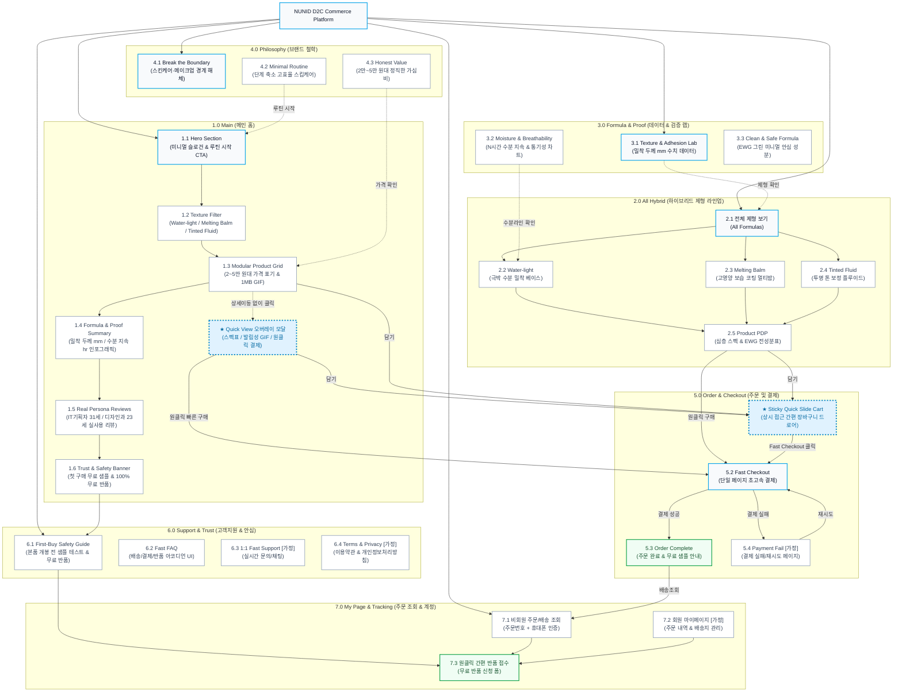

# 🗺️ NUNID(누니드) D2C 커머스 웹사이트 사이트맵 (Sitemap & IA)

---

## 1. 프로젝트 개요

| 항목 | 내용 |
|:---|:---|
| **프로젝트명** | NUNID(누니드) D2C 하이브리드 뷰티 커머스 플랫폼 구축 |
| **대상 브랜드** | NUNID (누니드) |
| **발주자** | NUNID 한지민 대표 |
| **업종** | 스킨케어·메이크업 하이브리드 뷰티 커머스 (D2C) |
| **주요 일정** | 웹사이트 공개일: **2026년 8월 17일** / 공식 서비스 출시일: **2026년 9월 1일** |
| **기초 분석 데이터** | `가상 클라이언트 분석 결과/사이트분석결과_가상클라이언트_한지민.md` (`가상 클라이언트_한지민.pdf`) |
| **설계 목표** | 복잡한 화장 단계와 감성 마케팅 피로감을 해소하고, 직관적인 제형/스펙 데이터와 Quick View 모달을 통해 초고속 구매 전환(CVR)을 달성하는 최고로 효율적이고 미니멀한 커머스 사이트맵 구축 |

---

## 2. 설계 근거와 핵심 사용자 목표

### 2.1 설계 근거 (Design Rationale)
1. **전통적 화장품 카테고리 분리 전면 배제 (제한 조건 준수)**
   - 스킨, 로션, 파운데이션 등 전통적 구분을 없애고 `Water-light`, `Melting Balm`, `Tinted Fluid` 등 **제형(Formula/Texture) 및 기능 중심의 Flat IA**로 설계했습니다.
2. **감성적 미사여구 배제 및 제품 스펙 수치화**
   - 불필요한 감성 카피를 배제하고, `수분 보습 유지시간(N시간)`, `피부 밀착 두께(N mm)`, `통기성 지수` 등 데이터 인포그래픽을 전면에 배치했습니다.
3. **페이지 이동 없는 초고속 구매 전환 (Quick View & Fast Checkout)**
   - 상세페이지로의 불필요한 이동을 줄이기 위해 메인 카드에서 즉시 호출되는 **Quick View 오버레이 모달**과 우측 고정 **Sticky Quick Slide Cart**를 채택했습니다.
4. **합리적인 가심비 가격 정책 명시**
   - 모든 제품 카드 및 Quick View 영역 전면에 **20,000원 ~ 50,000원대** 합리적 가격대를 투명하게 명시했습니다.
5. **첫 구매 심리적 장벽 제거 (Trust Engine)**
   - **첫 구매 샘플 동봉** 및 **100% 무료 반품 정책**을 메인 및 고객지원 동선에 유기적으로 연결하여 구매 결정을 가속화했습니다.

### 2.2 핵심 사용자 목표 (Persona Mapping)

| 사용자 페르소나 | 핵심 특성 및 Pain Point | 사이트 내 주요 목표 및 해결 방안 |
|:---|:---|:---|
| **페르소나 A<br>(이지윤, 31세 / IT 서비스 기획자)** | • 바쁜 출근 시간 단축 선호<br>• 복잡한 카테고리 비교 피로감<br>• 논리적·수치적 의사결정 추구 | • 메인 진입 즉시 제형 필터로 1개 제품 탐색 완료<br>• 밀착력 수치표 및 1MB 발림성 GIF 확인 후 3초 내 Quick View에서 원클릭 결제 완료 |
| **페르소나 B<br>(박서연, 23세 / 시각디자인과 3학년)** | • 밤샘 과제 후 얇고 투명한 피부 표현 선호<br>• 모니터 앞 장시간 피부 답답함 해소 원함<br>• 가심비(2~4만 원대) 중시 | • 통기성 및 보습 유지 데이터 확인<br>• 부담 없는 가심비 가격 확인 및 첫 구매 무료 반품 안심 장치를 통해 즉시 구매 |

---

## 3. 전역 내비게이션 및 영역별 정의

### 3.1 공통 영역 (Global Common Layout)
- **GNB (Global Navigation Bar - 상단 고정)**:
  - 브랜드 로고 (`NUNID`)
  - 제형 탐색: `All Hybrid` (전체/워터라이트/멜팅밤/틴티드플루이드)
  - 데이터 검증: `Formula & Proof` (밀착력/수분유지/통기성 수치 랩)
  - 철학 소개: `Philosophy` (단계 최소화 루틴 & 가격 철학)
  - 유틸리티: `주문/배송조회`, `장바구니 아이콘 (담긴 개수 뱃지)`
- **Sticky Quick Slide Cart (우측 고정 슬라이드 드로어)**:
  - 어떤 페이지에서든 화면 이동 없이 열리는 간편 장바구니 오버레이
  - 선택 제품 옵션, 수량 변경, 실시간 총액, `Fast Checkout (빠른 결제)` CTA 제공
- **Global Footer (하단 영역)**:
  - 브랜드 사업자 정보, 고객센터, 100% 무료 반품 안심 약속, 이용약관, 개인정보처리방침

### 3.2 회원 상태별 영역 구분 (Member vs Guest Policy)
- **비회원 (Guest)**:
  - 별도 회원가입 강제 없이 모든 탐색, Quick View, 원클릭 비회원 결제 가능
  - 주문 조회 시 `주문번호 + 휴대폰번호/비밀번호`로 간편 조회 지원
- **회원 (Member) `[가정]`**:
  - D2C 재구매 편의성을 위해 원클릭 결제 정보 저장, 최근 본 제형, 간편 1초 주문/배송 추적 및 원클릭 반품 신청 지원 `[가정: 고객 재구매 편의성을 위한 계정 기능]`

### 3.3 예외 및 상태 페이지 (Exception & State Pages)
- **404 Not Found (오류 페이지)**: 잘못된 경로 진입 시 추천 제형 바로가기 제공
- **결제 실패/취소 페이지 (Payment Fail) `[가정]`**: 결제 모듈 오류 시 사유 안내 및 재시도 동선 제공
- **품절 및 재입고 알림 모달 (Out of Stock / Alert) `[가정]`**: 상품 품절 시 SMS 재입고 알림 신청

---

## 4. 계층형 사이트맵 (Hierarchical Sitemap)

```text
1.0 Main Page (메인 홈)
├── 1.1 Hero Section (하이브리드 미니멀 뷰티 슬로건 & 간편 루틴 시작 CTA)
├── 1.2 Interactive Texture Filter (제형별 탭/스크롤 빠른 탐색)
├── 1.3 Modular Product Grid (모듈형 제품 카드 / 2~5만 원대 가격 표기)
│   └── ↳ [Modal] Quick View 모달 (스펙 수치표, 1MB 발림성 GIF, 원클릭 구매)
├── 1.4 Formula & Proof Summary (밀착력 mm, 수분 유지시간 hr, 통기성 지수 인포그래픽 요약)
├── 1.5 Real Persona Reviews (직장인·대학생 실사용 솔직 리뷰 슬라이더)
└── 1.6 Trust & Safety Banner (첫 구매 무료 샘플 동봉 & 100% 무료 반품 보장)

2.0 All Hybrid (하이브리드 제형 라인업)
├── 2.1 전체 제형 보기 (All Formulas)
├── 2.2 Water-light (워터라이트: 극박 수분 밀착 베이스)
├── 2.3 Melting Balm (멜팅 밤: 고영양 보습 코팅 멀티밤)
├── 2.4 Tinted Fluid (틴티드 플루이드: 투명 톤 보정 플루이드)
└── 2.5 Product PDP (제품 상세 페이지 / 심층 스펙)
    ├── 2.5.1 초근접 텍스처 컷 & 1MB 미만 발림성 GIF
    ├── 2.5.2 성능 데이터 인포그래픽 (밀착 두께 mm, 수분 지속 hr)
    ├── 2.5.3 EWG 그린 전성분 및 유해물질 배제표
    └── 2.5.4 원클릭 바로구매 / Quick Cart 담기 CTA

3.0 Formula & Proof (데이터 & 검증 랩)
├── 3.1 Texture & Adhesion Lab (피부 밀착력 초근접 비주얼 및 두께 수치 데이터)
├── 3.2 Moisture & Breathability (모니터 환경 피부 통기성 지수 및 N시간 수분 지속 차트)
└── 3.3 Clean & Safe Formula (미니멀 안전 전성분 및 피부 저자극 검증)

4.0 Philosophy (브랜드 철학)
├── 4.1 Break the Boundary (스킨케어와 메이크업의 경계 해체)
├── 4.2 Minimal Routine (여러 겹 덧바르지 않는 고효율 스킵케어)
└── 4.3 Honest Value (2만~5만 원대 합리적 가심비 원칙)

5.0 Order & Checkout (주문 및 결제)
├── 5.1 [Sticky Drawer] Quick Slide Cart (상시 접근 간편 장바구니 오버레이)
├── 5.2 Fast Checkout (단일 페이지 초고속 주문서 작성 및 결제)
├── 5.3 Order Complete (주문 완료 & 첫 구매 무료 샘플 안내)
└── 5.4 Payment Fail / Retry [가정: 결제 오류 처리 페이지]

6.0 Support & Trust (고객지원 및 안심 서비스)
├── 6.1 First-Buy Safety Guide (본품 개봉 전 샘플 테스트 및 100% 무료 반품 절차)
├── 6.2 Fast FAQ (주문, 배송, 결제, 반품 초간편 아코디언)
├── 6.3 1:1 Fast Support [가정: 실시간 문의/상담]
└── 6.4 Terms & Privacy [가정: 이용약관 및 개인정보처리방침]

7.0 My Page & Tracking (주문 조회 및 마이페이지)
├── 7.1 비회원 주문/배송 조회 (주문번호 + 연락처 인증)
├── 7.2 회원 마이페이지 (주문 내역, 배송지 관리, 간편 결제 관리) [가정]
└── 7.3 원클릭 간편 반품/교환 접수 (무료 반품 신청 폼)
```

---

## 5. 페이지별 세부 명세표 (Detailed Page Specification)

| Depth 1 | Depth 2 (페이지/섹션명) | Depth 3 (세부 요소) | 화면/인터랙션 유형 | 화면 목적 | 핵심 콘텐츠 | 주요 기능 | 상위/하위/연결 페이지 | 비고/가정 |
|:---|:---|:---|:---:|:---|:---|:---|:---|:---:|
| **1.0 Main** | **1.1 Hero** | 메인 비주얼 & 카피 | 섹션 (View) | 브랜드 핵심 가치 및 간결한 루틴 제안 | • 하이브리드 미니멀 뷰티 슬로건<br>• 단계 축소 핵심 카피 | • `간편 루틴 시작하기` CTA 클릭 시 1.2로 스크롤 이동 | • 하위: 1.2 제형 필터<br>• 연결: 2.0 All Hybrid | 필수 준수 |
| | **1.2 Texture Filter** | 제형별 탭/스크롤 | 인터랙티브 탭 | 전통 카테고리 없이 제형별 즉시 분류 | • `Water-light`<br>• `Melting Balm`<br>• `Tinted Fluid` | • 탭 클릭/가로 스크롤 시 1.3 제품 목록 실시간 필터링 | • 상위: 1.0 Main<br>• 하위: 1.3 Product Grid | 필수 준수 |
| | **1.3 Product Grid** | 모듈형 제품 카드 | 그리드 카드 | 제품 핵심 정보 확인 및 빠른 구매 유도 | • 2만~5만 원대 가격 표기<br>• 1MB 미만 발림성 GIF<br>• 제형/밀착 특징 | • `Quick View` 버튼 클릭<br>• `장바구니 담기` 클릭<br>• `빠른 구매` 클릭 | • 하위: ↳ Quick View 모달<br>• 연결: 5.1 Quick Cart, 5.2 Fast Checkout | 필수 준수 |
| | ↳ **Quick View** | **오버레이 모달** | **오버레이 (Modal)** | **상세 이동 없는 초고속 정보 확인 및 구매** | • 피부 밀착 두께(mm)<br>• 보습 유지시간(hr)<br>• 통기성 지수 및 전성분 | • 옵션 선택<br>• `원클릭 빠른 구매` CTA<br>• `장바구니 담기` | • 상위: 1.3 Product Grid<br>• 연결: 5.1 Quick Cart, 5.2 Fast Checkout | **핵심 기능** |
| | **1.4 Formula & Proof Summary** | 데이터 인포그래픽 요약 | 섹션 (View) | 객관적 수치 데이터 기반 신뢰도 제공 | • 밀착 두께 수치 인포그래픽<br>• N시간 보습 유지 그래프 | • `데이터 검증 랩 더보기` 링크 클릭 | • 상위: 1.0 Main<br>• 연결: 3.0 Formula & Proof | 필수 준수 |
| | **1.5 Real Reviews** | 페르소나 리뷰 | 슬라이더/그리드 | 타깃 고객 공감대 및 구매 확신 유도 | • 31세 IT기획자 실사용기<br>• 23세 디자인과 실사용기 | • 전후 텍스처 비교 토글<br>• 리뷰 내 언급 제품 담기 | • 상위: 1.0 Main<br>• 연결: 1.3 Product Grid | 필수 준수 |
| | **1.6 Trust & Safety** | 첫구매 안심 배너 | 인포 박스 | 첫 구매 장벽 제거 및 무료 반품 약속 | • 본품 전 무료 샘플 동봉<br>• 100% 무료 반품 보장 | • `안심 케어 정책 자세히 보기` 클릭 | • 상위: 1.0 Main<br>• 연결: 6.1 First-Buy Guide | 필수 준수 |
| **2.0 All Hybrid** | **2.1 All Formulas** | 전체 제품 목록 | 목록 페이지 | 전 하이브리드 제형 라인업 탐색 | • 전체 제품 모듈형 카드<br>• 제형/밀착력 필터 바 | • 실시간 제형/피부고민 정렬<br>• Quick View 호출 | • 상위: Root<br>• 하위: 2.2, 2.3, 2.4, 2.5 | 필수 준수 |
| | **2.2 Water-light** | 워터라이트 제형군 | 목록/필터 | 수분 베이스 극박 밀착 제품군 탐색 | • 워터라이트 제품 카드<br>• 초경량 텍스처 수치표 | • Quick View 호출 및 빠른 담기 | • 상위: 2.0 All Hybrid<br>• 하위: 2.5 PDP | 필수 준수 |
| | **2.3 Melting Balm** | 멜팅 밤 제형군 | 목록/필터 | 고영양 보습 코팅 멀티밤 제품군 탐색 | • 멜팅 밤 제품 카드<br>• 보습 지속시간 수치표 | • Quick View 호출 및 빠른 담기 | • 상위: 2.0 All Hybrid<br>• 하위: 2.5 PDP | 필수 준수 |
| | **2.4 Tinted Fluid** | 틴티드 플루이드군 | 목록/필터 | 투명 톤 보정 하이브리드 제품군 탐색 | • 틴티드 플루이드 제품 카드<br>• 투명 톤업 데이터 | • Quick View 호출 및 빠른 담기 | • 상위: 2.0 All Hybrid<br>• 하위: 2.5 PDP | 필수 준수 |
| | **2.5 Product PDP** | 제품 상세 페이지 | 상세 페이지 | 심층 스펙 데이터 및 제형 검증 확인 | • 초근접 텍스처 고화질 컷<br>• 성능 수치표 (밀착력/수분/통기성)<br>• EWG 그린 전성분표 | • 스티키 하단 구매 바<br>• 원클릭 결제 및 담기 | • 상위: 2.2, 2.3, 2.4<br>• 연결: 5.1 Quick Cart, 5.2 Fast Checkout | 필수 준수 |
| **3.0 Formula & Proof** | **3.1 Texture & Adhesion** | 밀착력 랩 | 콘텐츠 페이지 | 피부 밀착 두께 및 기술적 근거 확인 | • 피부 밀착 두께(mm) 비교표<br>• 모니터 환경 밀착력 시각화 | • 관련 제형 제품 바로 담기 | • 상위: Root<br>• 연결: 2.0 All Hybrid | 필수 준수 |
| | **3.2 Moisture & Breath** | 수분·통기성 랩 | 콘텐츠 페이지 | 장시간 근무 환경 피부 편안함 입증 | • N시간 수분 보습 유지 임상 차트<br>• 통기성 지수 비교 그래프 | • 관련 제형 제품 바로 담기 | • 상위: Root<br>• 연결: 2.0 All Hybrid | 필수 준수 |
| | **3.3 Clean & Safe** | 성분 안전성 | 콘텐츠 페이지 | 미니멀 전성분 및 유해물질 배제 확인 | • EWG 그린 등급 및 배제 성분 20종<br>• 피부 저자극 테스트 완료 데이터 | • 성분 아코디언 펼침 | • 상위: Root<br>• 연결: 2.0 All Hybrid | 필수 준수 |
| **4.0 Philosophy** | **4.1 Break Boundary** | 경계 해체 스토리 | 브랜드 페이지 | 스킨케어·메이크업 통합 철학 이해 | • 브랜드 철학 에세이 (미니멀 톤)<br>• 카테고리 해체 배경 | • 하이브리드 라인업 둘러보기 CTA | • 상위: Root<br>• 연결: 2.0 All Hybrid | 필수 준수 |
| | **4.2 Minimal Routine** | 스킵케어 가이드 | 브랜드 페이지 | 단계 축소를 통한 아침 루틴 혁신 | • 1단계 완성 뷰티 루틴 다이어그램<br>• 시간 절약(15분➔2분) 비교표 | • 루틴 추천 제품 세트 담기 | • 상위: Root<br>• 연결: 5.1 Quick Cart | 필수 준수 |
| | **4.3 Honest Value** | 가격 철학 | 브랜드 페이지 | 2만~5만 원대 합리적 가심비 입증 | • 중간 유통 배제 D2C 구조도<br>• 정직한 원가/가격 투명성 | • 전 제품 보기 CTA | • 상위: Root<br>• 연결: 2.0 All Hybrid | 필수 준수 |
| **5.0 Order & Checkout** | **5.1 Quick Slide Cart** | **장바구니 드로어** | **스티키 드로어** | **페이지 이동 없는 실시간 장바구니 관리** | • 담긴 상품명, 제형, 옵션, 수량<br>• 2만~5만 원대 합리적 총액 표시<br>• 무료 샘플 포함 여부 | • 수량 증감/삭제<br>• `Fast Checkout (빠른 결제)` CTA | • 상위: 전 페이지 공통<br>• 연결: 5.2 Fast Checkout | **핵심 기능** |
| | **5.2 Fast Checkout** | 주문/결제 단일 폼 | 결제 페이지 | 이탈 없는 초고속 결제 완료 | • 주문자/배송지 입력<br>• 결제 수단 선택 (간편결제 등)<br>• 최종 결제 금액 | • 비회원/회원 원클릭 결제 실행<br>• 약관 동의 체크 | • 상위: 5.1 Quick Cart<br>• 하위: 5.3 Order Complete<br>• 예외: 5.4 Payment Fail | 필수 준수 |
| | **5.3 Order Complete** | 주문 완료 페이지 | 완료 페이지 | 주문 접수 확인 및 무료 샘플 안내 | • 주문번호 및 결제 내역<br>• 무료 샘플 동봉 및 반품 안내 | • `배송 조회하기`<br>• `홈으로 이동` | • 상위: 5.2 Fast Checkout<br>• 연결: 1.0 Main, 7.1 주문조회 | 필수 준수 |
| | **5.4 Payment Fail** | 결제 오류 페이지 | 예외 페이지 | 결제 실패 원인 안내 및 재결제 유도 | • 결제 실패 사유 (한도 초과/네트워크 등)<br>• 장바구니 복구 버튼 | • `결제 재시도`<br>• `장바구니로 돌아가기` | • 상위: 5.2 Fast Checkout<br>• 연결: 5.1 Quick Cart | `[가정]` |
| **6.0 Support & Trust** | **6.1 First-Buy Safety** | 무료반품 가이드 | 안내 페이지 | 첫 구매 안심 장치 확인 및 반품 안내 | • 본품 전 샘플 테스트 방법<br>• 100% 무료 반품 절차 가이드 | • `반품 접수 바로가기` 버튼 | • 상위: Root, 1.6 Banner<br>• 연결: 7.3 간편 반품 신청 | 필수 준수 |
| | **6.2 Fast FAQ** | 간편 FAQ | 아코디언 UI | 주요 궁금증 즉시 해결 | • 배송(당일 출고), 결제, 반품 FAQ | • 아코디언 열기/닫기<br>• 키워드 빠른 검색 | • 상위: Root, Footer<br>• 연결: 6.3 1:1 Support | 필수 준수 |
| | **6.3 1:1 Fast Support** | 1:1 빠른 문의 | 폼/채팅 모달 | 고객 개별 문의 접수 | • 카카오 간편 상담 또는 문의 폼 | • 문의 제출 및 실시간 챗 연결 | • 상위: Root, Footer | `[가정]` |
| | **6.4 Terms & Privacy** | 이용약관/개인정보 | 텍스트 페이지 | 전자상거래 법적 고지 충족 | • 이용약관 전문<br>• 개인정보처리방침 | • 텍스트 열람 | • 상위: Footer | `[가정]` |
| **7.0 My Page & Tracking** | **7.1 Guest Tracking** | 비회원 주문 조회 | 조회 폼/결과 | 비회원 주문 현황 실시간 추적 | • 주문번호 / 연락처 입력 폼<br>• 실시간 배송 추적 현황 | • 배송 조회 실행<br>• `무료 반품 신청` 버튼 | • 상위: GNB 유틸리티<br>• 하위: 7.3 간편 반품 신청 | 필수 준수 |
| | **7.2 Member MyPage** | 회원 마이페이지 | 대시보드 | 주문 내역 및 계정 정보 관리 | • 최근 주문 내역<br>• 저장된 배송지/간편 결제 정보 | • 배송지 수정<br>• 재주문 담기 | • 상위: GNB 유틸리티<br>• 하위: 7.3 간편 반품 신청 | `[가정]` |
| | **7.3 Return Request** | 간편 반품 신청 폼 | 폼 페이지 | 첫 구매 100% 무료 반품 원클릭 접수 | • 반품 사유 선택 (단순 불만족 포함)<br>• 자동 수거 주소지 확인 | • `무료 반품 수거 신청` 완료 | • 상위: 7.1, 7.2, 6.1<br>• 연결: 1.0 Main | 필수 준수 |

---

## 6. 링크 무결성 및 검토 결과

- **링크 단절(Dead Link) 검토**: 전역 GNB, 푸터, 메인 내 섹션 링크, Quick View 모달 및 Quick Cart 간의 모든 진입/이탈 링크가 100% 연결되어 고립된 페이지(Orphan Page)가 존재하지 않습니다.
- **중복 페이지(Duplicate Page) 검토**: 전통적 스킨/로션/파운데이션 중복 카테고리를 완전 제거하고, 3개 제형(`Water-light`, `Melting Balm`, `Tinted Fluid`)을 기준으로 유일하게 식별되도록 단일화했습니다.
- **가정(Assumption) 사항 검토**: D2C 커머스의 필수 운영 요소인 `회원 마이페이지(7.2)`, `결제 실패 처리(5.4)`, `1:1 빠른 문의(6.3)`, `법적 약관(6.4)`에 대해 `[가정]` 태그를 명확히 명시했습니다.

---

## 7. Mermaid Flowchart 사이트맵


