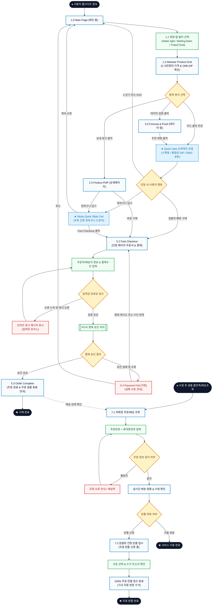

# 🔄 NUNID(누니드) D2C 커머스 서비스 흐름도 (Service User Flow)

> **기반 자료**: [가상 클라이언트 분석 결과/사이트분석결과_가상클라이언트_한지민.md](file:///C:/Users/SBS/pjy/가상%20클라이언트%20분석%20결과/사이트분석결과_가상클라이언트_한지민.md) / [가상 클라이언트 설계 결과/사이트 구조맵/사이트맵.md](file:///C:/Users/SBS/pjy/가상%20클라이언트%20설계%20결과/사이트%20구조맵/사이트맵.md)  
> **핵심 원칙**: 탐색 ➔ 선택 ➔ 상세 확인 ➔ 핵심 행동 ➔ 결과 확인의 단축 동선, 상세페이지 이동 없는 Quick View 모달, 1단계 Fast Checkout, 첫 구매 100% 무료 반품 안심 흐름

---

## 1. 서비스 흐름 개요 (Service Flow Overview)

NUNID(누니드) 서비스 흐름은 **"화장 단계를 줄이듯, 구매 여정의 단계도 극도로 줄인다"**는 브랜드 철학을 바탕으로 설계되었습니다.  
기존 전통 이커머스의 `메인 ➔ 카테고리 ➔ 목록 ➔ 상세페이지 ➔ 장바구니 ➔ 복잡한 주문서 ➔ 결제`의 7~8단계 긴 동선을 **`메인 ➔ 제형 필터 ➔ Quick View 모달 ➔ Fast Checkout`의 3~4단계 단축 동선**으로 압축하여 초고속 구매 전환율(CVR)을 달성합니다.

---

## 2. 사용자 유형과 시작 조건 (User Types & Entry Conditions)

| 사용자 유형 | 시작 조건 (Entry Condition) | 핵심 요구 및 목표 | 최종 도달 목표 (Goal) |
|:---|:---|:---|:---|
| **유형 1: 페르소나 A<br>(31세 IT기획자 / 초고속 탐색형)** | • 출근 전 또는 업무 중 모바일/PC로 접속<br>• 탐색 시간 극소화 필요 | • 감성 카피 없이 제형과 스펙(밀착 두께 mm, 수분 유지 hr) 즉시 확인<br>• 상세 이동 없이 1분 내 구매 | • Quick View 모달에서 원클릭 결제 완료 (`5.3 Order Complete`) |
| **유형 2: 페르소나 B<br>(23세 디자인과 / 데이터 검증형)** | • 밤샘 과제 후 피부 답답함 해소 제품 검색<br>• 가심비(2~4만 원대) 중시 | • 통기성/밀착력 수치 차트 및 1MB 발림성 GIF 확인<br>• 첫 구매 무료 샘플 및 무료 반품 보장 확인 후 구매 | • Formula & Proof 검증 후 Fast Checkout 결제 완료 |
| **유형 3: 기존 주문 고객<br>(안심 반품 및 배송 조회형)** | • 제품 수령 후 샘플 테스트 고객<br>• 비회원 또는 회원 주문 고객 | • 배송 현황 추적<br>• 본품 개봉 전 불만족 시 원클릭 무료 반품 접수 | • 100% 무료 반품 수거 신청 접수 완료 (`7.3 Return Request`) |

---

## 3. 핵심 정상 흐름 (Happy Paths)

```text
[탐색]                [선택]               [상세 확인]              [핵심 행동]            [결과 확인]
1.0 메인 / 제형 필터  ➔ 1.3 제품 카드 클릭 ➔ ★ Quick View 오버레이 ➔ 원클릭 빠른 결제 CTA ➔ 5.3 주문 완료
```

### 3.1 [핵심 경로 1] 메인 직결 초고속 구매 흐름 (Express Main-to-Checkout)
1. **[탐색]**: 사용자가 `1.0 Main Page`에 진입하여 상단 `1.2 Texture Filter`에서 원하는 제형(`Water-light`, `Melting Balm`, `Tinted Fluid`)을 탭합니다.
2. **[선택]**: 필터링된 `1.3 Modular Product Grid`에서 2만~5만 원대 가격과 요약 스펙을 확인하고 제품 카드를 클릭합니다.
3. **[상세 확인]**: 페이지 이동 없이 화면 위에 **`★ Quick View 오버레이 모달`**이 즉시 열리며, 1MB 미만 발림성 GIF, 피부 밀착 두께(N mm), 수분 보습 유지시간(N hr), EWG 전성분을 3초 만에 확인합니다.
4. **[핵심 행동]**: 옵션 선택 후 **`[원클릭 빠른 구매]`** CTA 버튼을 누릅니다.
5. **[결제]**: 단일 페이지로 구성된 `5.2 Fast Checkout`에서 배송지 및 결제 수단을 입력하고 결제를 승인합니다.
6. **[결과 확인]**: `5.3 Order Complete` 화면에서 주문번호 및 첫 구매 무료 샘플 동봉 안내를 확인합니다.

### 3.2 [핵심 경로 2] 라인업 탐색 & Quick Cart 다품목 구매 흐름
1. **[탐색]**: GNB의 `2.0 All Hybrid` 또는 특정 제형 메뉴(`2.2 Water-light` 등)로 이동합니다.
2. **[상세 확인]**: `2.5 Product PDP`에서 심층 텍스처 및 성분 데이터를 확인합니다.
3. **[장바구니 담기]**: `[장바구니 담기]` 클릭 시 우측에서 **`★ Sticky Quick Slide Cart`** 드로어가 열리며 담긴 상품과 합리적 가심비 총액을 확인합니다.
4. **[체크아웃]**: `[Fast Checkout]` 버튼을 클릭하여 `5.2 Fast Checkout`으로 직결 이동합니다.

### 3.3 [핵심 경로 3] Formula & Proof 데이터 검증 후 구매 흐름
1. **[데이터 확인]**: GNB의 `3.0 Formula & Proof` 진입 ➔ 밀착 두께/통기성 지수/수분 지속 임상 차트 확인
2. **[제품 연결]**: 데이터 차트 하단의 `[해당 제형 바로보기]` 클릭 ➔ `Quick View 모달` 호출 ➔ `Fast Checkout` 이동

### 3.4 [핵심 경로 4] 첫 구매 100% 무료 반품 흐름 (Trust Loop)
1. **[진입]**: 수령한 무료 샘플 사용 후 불만족 시 `7.1 비회원 주문/배송 조회` (주문번호+휴대폰번호 입력)
2. **[신청]**: 주문 상세 내역에서 `[100% 무료 반품 신청]` 클릭
3. **[완료]**: `7.3 간편 반품 신청`에서 사유 체크 후 수거 접수 완료 (택배 기사 자동 방문 접수)

---

## 4. 분기, 오류, 이탈 및 재진입 흐름 (Branching, Error & Fallback)

### 4.1 로그인/회원 상태 분기
- **비회원 (기본)**: 회원가입 절차 없이 주문자명, 휴대폰번호, 배송지만으로 즉시 결제 (`비회원 약관 동의`).
- **회원 `[가정]`**: 간편 로그인 연동 시 저장된 기본 배송지 및 원클릭 결제 수단이 자동 로드되어 1초 만에 결제 승인.

### 4.2 입력값 유효성 검사 오류 (Validation Error)
- **발생 지점**: `5.2 Fast Checkout` 주문서 작성 시
- **조건**: 필수 배송지 주소 누락, 휴대폰 번호 자릿수 오류, 약관 미동의
- **시스템 처리**: 폼 제출 차단, 해당 필드 하단에 인라인 경고 문구(붉은색) 노출 및 자동 포커스 이동 ➔ 정상 입력 시 즉시 에러 해제.

### 4.3 결제 승인 실패 처리 (Payment Failure)
- **발생 지점**: PG사 결제 승인 요청 중
- **조건**: 카드 한도 초과, 잔액 부족, 인증 시간 초과, 네트워크 단절
- **시스템 처리**: `5.4 Payment Fail [가정]` 화면으로 전환 ➔ 명확한 실패 사유 안내 ➔ 이전 작성한 주문서 정보 및 장바구니 품목 100% 유지 ➔ **`[결제 재시도]`** 또는 **`[다른 결제수단 선택]`** 클릭 시 `5.2 Fast Checkout`으로 안전 복귀.

### 4.4 이탈 및 탐색 재진입 (Modal Close & Cart Persistence)
- **Quick View 모달 이탈**: 모달 외부 배경 클릭, `ESC` 키, `[닫기 X]` 버튼 클릭 시 메인페이지의 이전 스크롤 위치를 100% 유지하며 복귀.
- **장바구니 상태 보존**: 모달에서 `[장바구니 담기]` 후 결제하지 않고 메인으로 돌아가도, 상단 GNB의 `Quick Cart` 아이콘에 실시간 품목 수 뱃지가 유지되어 언제든 원클릭으로 구매 재개 가능.

---

## 5. 단계별 사용자 행동 및 시스템 처리 명세표 (Detailed Step Specification)

| 단계 (Step) | 현재 화면 (Screen) | 사용자 행동 (User Action) | 시스템 처리 (System Processing) | 분기/예외 조건 (Condition) | 다음 화면 (Next Screen) |
|:---|:---|:---|:---|:---|:---|
| **ST-01** | `1.0 Main Page` | 메인 접속 후 `1.2 Texture Filter` 탭 클릭 | 선택 제형에 해당하는 상품 데이터 비동기(AJAX) 필터링 | • 데이터 로딩 지연: 스켈레톤 UI 노출 | `1.3 Product Grid` (필터 적용 상태) |
| **ST-02** | `1.3 Product Grid` | 제품 카드 클릭 | • 클릭 제품의 스펙/GIF/옵션 데이터 로드<br>• 배경 딤(Dim) 처리 및 오버레이 렌더링 | • 품절 상품: `[재입고 알림 신청]` 뱃지 표기 `[가정]` | **`★ Quick View 모달`** |
| **ST-03** | **`★ Quick View 모달`** | 스펙/발림성 GIF 확인 후 옵션 선택 & `[원클릭 빠른 구매]` 클릭 | • 선택 옵션 및 단일 상품 결제 세션 생성<br>• 체크아웃 페이지 데이터 전달 | • [닫기] 클릭: 모달 닫힘, 메인 위치 유지<br>• [장바구니 담기] 클릭: ST-04로 분기 | `5.2 Fast Checkout` |
| **ST-04** | **`★ Quick View 모달`** | `[장바구니 담기]` 클릭 | • LocalStorage/세션에 품목 추가<br>• 우측 고정 슬라이드 드로어 오픈 | • 무료배송 기준/샘플 동봉 자동 계산 | **`★ Quick Slide Cart`** |
| **ST-05** | **`★ Quick Slide Cart`** | 수량 확인 후 `[Fast Checkout]` 클릭 | 장바구니 전체 품목 주문서 생성 | • 장바구니 비었을 때: 빈 안내 문구 | `5.2 Fast Checkout` |
| **ST-06** | `5.2 Fast Checkout` | 배송지/연락처 입력 및 결제 수단 선택 후 `[결제하기]` 클릭 | • 입력값 유효성 검사<br>• PG사 결제창 호출 및 승인 요청 | • 입력 누락: 인라인 에러 노출 (ST-06 유지)<br>• 결제 실패: `5.4 Payment Fail` 이동<br>• 결제 성공: ST-07 이동 | `5.3 Order Complete` |
| **ST-07** | `5.3 Order Complete` | 주문 완료 확인 및 `[배송조회]` 클릭 | 주문 DB 저장 및 무료 샘플 발송 안내장 렌더링 | • 정상 완료 | `7.1 비회원 주문/배송 조회` |
| **ST-08** | `7.1 비회원 주문조회` | 주문번호 + 휴대폰번호 입력 후 조회 | 주문번호 일치 여부 검증 및 실시간 배송 상태 출력 | • 정보 불일치: 주문번호 오류 안내<br>• 배송 완료 상태: [무료 반품 신청] 활성화 | `7.1 조회 결과 뷰` |
| **ST-09** | `7.1 조회 결과 뷰` | `[100% 무료 반품 신청]` 버튼 클릭 | 반품 가능 기한(수령 후 N일) 검증 및 신청서 로드 | • 반품 기한 초과: 고객센터 문의 안내 | `7.3 간편 반품 신청` |
| **ST-10** | `7.3 간편 반품 신청` | 반품 사유 선택 및 수거지 확인 후 `[반품 접수 완료]` 클릭 | 택배사 자동 수거 접수 및 환불 예정 안내 생성 | • 접수 완료 | `7.3 반품 완료 안내` ➔ `1.0 Main` |

---

## 6. Mermaid Flowchart 전체 서비스 흐름도



---

## 7. 검토 및 링크 무결성 확인

- **시작점/종료점 명시**: 일반 구매 시작(`Start`), 사후 관리 시작(`ReturnStart`), 구매 완료(`EndBuy`), 무료 반품 완료(`EndReturn`)의 진입/종료 노드를 명확히 분리했습니다.
- **사이트맵 화면명 100% 일치**: `1.0 Main Page`, `1.2 Texture Filter`, `1.3 Modular Product Grid`, `Quick View 모달`, `2.5 Product PDP`, `3.0 Formula & Proof`, `5.1 Quick Slide Cart`, `5.2 Fast Checkout`, `5.3 Order Complete`, `5.4 Payment Fail`, `7.1 비회원 주문/배송 조회`, `7.3 간편 반품 접수` 등 사이트맵의 모든 명칭과 1:1 매핑을 완료했습니다.
- **도달 불가(Dead-end) 단계 없음**: 결제 오류 시 복구 경로(`PayFail ➔ Checkout`), 모달 닫기 시 메인 복귀, 조회 실패 시 재시도 경로 등 모든 예외 상황의 복귀 경로를 100% 구축했습니다.
