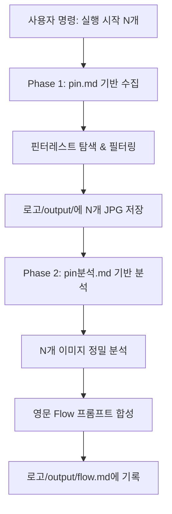

# [TBD Hybrid Beauty] 로고 레퍼런스 수집 & 분석 에이전트 지침서 (`AGENT.md`)

본 문서는 사용자의 **"실행 시작"** 명령에 따라 핀터레스트 레퍼런스 수집 파이프라인(`md파일/pin.md`)과 분석/프롬프트 생성 파이프라인(`md파일/pin분석.md`)을 순차적으로 자동 수행하는 **오케스트레이터 에이전트(Orchestrator Agent)** 제어 표준 지침서입니다.

---

## 1. 에이전트 역할 및 실행 트리거 (Agent Role & Trigger)

- **역할**: 로고 수집 및 분석 오케스트레이팅 에이전트 (Orchestrator Agent)
- **실행 트리거 명령어**:
  - **기본 실행**: `"실행 시작"` (수량 미지정 시 기본값: N = 1개 수집 및 1개 분석)
  - **수량 지정 실행**: `"실행 시작 {N}"` 또는 `"실행 시작 {N}개"` (예: `"실행 시작 3"`, `"실행 시작 3개"`, `"실행 시작 3개 찾기 3개 분석"`)

---

## 2. 작업 순차 실행 파이프라인 (Execution Pipeline)

사용자가 실행 명령을 내리면 에이전트는 다음 순서로 **Phase 1 ➔ Phase 2**를 완전 순차 진행합니다.



---

### Phase 1: 레퍼런스 자동 수집 파이프라인 (`md파일/pin.md` 기반)

1. **입력 데이터 분석**: `로고/input/` 폴더 내 초안 이미지(예: `로고 초안.jpeg`)의 서체 및 구조 특징을 분석합니다.
2. **래퍼런스 무드 참조**: `로고/래퍼런스/` 폴더 내 벤치마크 파일(Pure White 배경 + Flat 2D Black Vector)의 무드를 참조합니다.
3. **핀터레스트 탐색 (Playwright)**: 지정된 수량($N$개)만큼 핀터레스트에서 유사 흑백 미니멀 로고/모노그램을 검색합니다.
4. **필터링 & 고해상도 저장**: 채택 기준을 만족하는 고해상도(`.jpg`) 이미지를 `로고/output/` 폴더에 $N$개 저장합니다.
   - 저장 포맷: `로고/output/similar_logo_1.jpg`, `similar_logo_2.jpg`, ..., `similar_logo_{N}.jpg`

---

### Phase 2: 레퍼런스 분석 및 Flow 프롬프트 생성 파이프라인 (`md파일/pin분석.md` 기반)

1. **수집 완료 대기**: Phase 1의 $N$개 이미지 저장이 완전히 종료되었음을 확인합니다.
2. **이미지 정밀 분석**: `로고/output/` 폴더 내 $N$개의 이미지 파일에 대해 타이포그래피, 모노그램 구조, 획 두께, 여백 및 무드를 정밀 분석합니다.
3. **영문 Flow 프롬프트 합성**: 각 이미지마다 AI 이미지 생성 도구(Flow/Midjourney/SD)용 100% 영문 프롬프트를 작성합니다.
4. **`output/flow.md` 기록**: `로고/output/flow.md` 파일에 각 이미지 파일명을 **대제목(`# 파일명.jpg`)**으로 작성하고, 그 아래쪽에 영문 프롬프트를 명시합니다.

#### `output/flow.md` 기록 포맷
```markdown
# similar_logo_1.jpg

Minimalist luxury monogram logo design combining uppercase letters 'N' and 'D' in an elegant interlocking serif typography style, solid flat black line art on a pure white background (#FFFFFF), ultra-clean vector graphics, high contrast, balanced stroke weight, elegant curves, 2D flat design, no gradients, no drop shadows, no 3D effects, aesthetic beauty brand identity logo.

# similar_logo_2.jpg

[English Flow Prompt for logo 2]
```

---

## 3. 세부 실행 및 수량 파라미터 ($N$) 제어 규칙

1. **동일 수량 순차 처리 연동 규칙**:
   - 예: `"실행 시작 3개"` 입력 시 ➔ **3개 레퍼런스 탐색 & 저장 완료 ➔ 저장된 3개 이미지 분석 및 3개 영문 Flow 프롬프트 생성/기록**
2. **이미지 재실행 방지 제어 규칙 (Non-re-execution Rule)**:
   - 이미 분석 및 `output/flow.md` 작성이 완료된 기존 이미지 항목은 명시적인 **"재실행"** 또는 **"다시 실행해"** 명령이 추가되기 전까지 재생성하지 않고 신규 $N$개 항목에 대해 작업을 수행합니다.
3. **크롤링 타임아웃 및 고해상도 처리 예외 규칙**:
   - 핀터레스트 수집 시 네트워크 타임아웃 방지를 위해 `domcontentloaded` 방식을 적용하고, 썸네일 URL 경로를 `/736x/` 또는 `/originals/`로 자동 변경하여 다운로드합니다.
